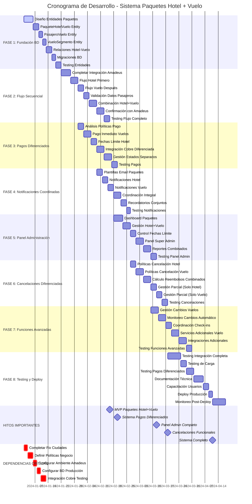

# Cronograma de Actividades - Desarrollo Sistema Hotel + Vuelo

## 📋 **DETALLES DEL CRONOGRAMA**

### **⏱️ ESTIMACIÓN TOTAL**
- **Duración Total:** 14-18 semanas
- **Recursos Necesarios:** 2-3 desarrolladores
- **Fases Críticas:** 1, 2, 3 (fundación y flujo secuencial)

### **🎯 HITOS CLAVE ACTUALIZADOS**
1. **MVP Paquetes Hotel+Vuelo** - Semana 5
2. **Sistema Pagos Diferenciados** - Semana 8
3. **Panel Admin Completo** - Semana 12
4. **Cancelaciones Funcionales** - Semana 15
5. **Sistema Completo** - Semana 17

### **📊 CAMBIOS PRINCIPALES**

#### **🎯 ENFOQUE ACTUAL:**
- **Flujo secuencial:** Hotel primero, vuelo después
- **Pagos diferenciados:** Inmediato vuelo, fechas límite hotel
- **Gestión coordinada:** Un solo paquete, dos sistemas de pago
- **Administración unificada:** Panel integral

#### **⚠️ RIESGOS REDUCIDOS:**
- **Menos complejidad** sin descuentos
- **Flujo más claro** con secuencia definida
- **Menos puntos de fallo** sin múltiples opciones

### **🔄 PARALELIZACIÓN ACTUALIZADA**
- **Fases 3 y 4** pueden ejecutarse en paralelo
- **Fases 6 y 7** pueden solaparse
- **Testing continuo** durante todo el desarrollo

### **🎯 PRÓXIMOS PASOS INMEDIATOS**

1. **Definir Entidades BD** - Paquetes hotel+vuelo
2. **Configurar Flujo Secuencial** - Hotel → Vuelo
3. **Implementar Pagos Diferenciados** - Inmediato vs fechas límite
4. **Crear Panel Unificado** - Gestión coordinada
5. **Testing Integral** - Flujo completo
