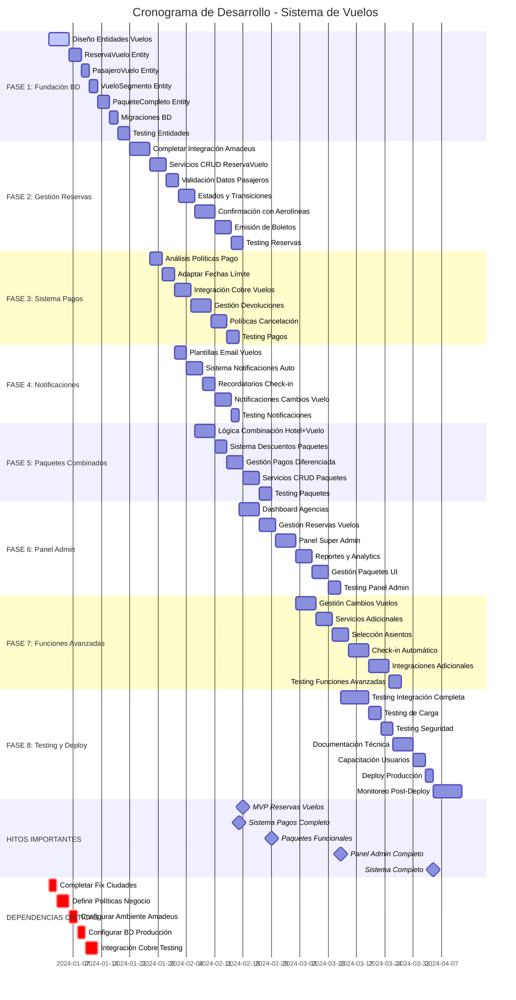

# Cronograma de Actividades - Desarrollo Módulo de Vuelos

## 📋 **DETALLES DEL CRONOGRAMA**

### **⏱️ ESTIMACIÓN TOTAL**
- **Duración Total:** 16-20 semanas
- **Recursos Necesarios:** 2-3 desarrolladores
- **Fases Críticas:** 1, 2, 3 (fundación del sistema)

### **🎯 HITOS CLAVE**
1. **MVP Reservas Vuelos** - Semana 6
2. **Sistema Pagos Completo** - Semana 9
3. **Paquetes Funcionales** - Semana 11
4. **Panel Admin Completo** - Semana 14
5. **Sistema Completo** - Semana 18

### **⚠️ RIESGOS Y DEPENDENCIAS**
- **Integración Amadeus** - Riesgo alto, crítico para todo el sistema
- **Políticas de Aerolíneas** - Variables, pueden afectar desarrollo
- **Sincronización con Sistema Actual** - Requiere cuidado especial
- **Testing con Datos Reales** - Necesario ambiente de pruebas robusto

### **🔄 PARALELIZACIÓN**
- **Fases 3 y 4** pueden ejecutarse en paralelo
- **Fases 5 y 6** pueden solaparse
- **Testing continuo** durante todo el desarrollo
