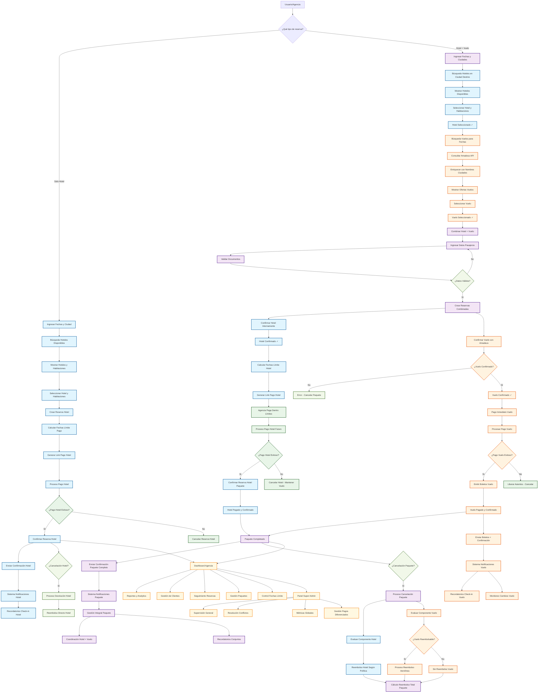

# Diagrama de Flujo - Sistema de Reservas de Vuelos

```mermaid
flowchart TD
    A[Usuario/Agencia] --> B{¿Qué tipo de reserva?}
    
    B -->|Solo Hotel| C[Ingresar Fechas y Ciudad]
    B -->|Hotel + Vuelo| D[Ingresar Fechas y Ciudades]
    
    %% Flujo Solo Hotel
    C --> E[Búsqueda Hoteles Disponibles]
    E --> F[Mostrar Hoteles y Habitaciones]
    F --> G[Seleccionar Hotel y Habitaciones]
    G --> H[Crear Reserva Hotel]
    H --> I[Calcular Fechas Límite Pago]
    I --> J[Generar Link Pago Hotel]
    J --> K[Proceso Pago Hotel]
    
    %% Flujo Paquete Hotel + Vuelo
    D --> L[Búsqueda Hoteles en Ciudad Destino]
    L --> M[Mostrar Hoteles Disponibles]
    M --> N[Seleccionar Hotel y Habitaciones]
    N --> O[Hotel Seleccionado ✓]
    
    %% Ahora búsqueda de vuelos
    O --> P[Búsqueda Vuelos para Fechas]
    P --> Q[Consultar Amadeus API]
    Q --> R[Enriquecer con Nombres Ciudades]
    R --> S[Mostrar Ofertas Vuelos]
    S --> T[Seleccionar Vuelo]
    T --> U[Vuelo Seleccionado ✓]
    
    %% Combinación de servicios
    U --> V[Combinar Hotel + Vuelo]
    V --> X[Ingresar Datos Pasajeros]
    X --> Y[Validar Documentos]
    Y --> Z{¿Datos Válidos?}
    Z -->|No| X
    Z -->|Sí| AA[Crear Reservas Combinadas]
    
    %% Confirmaciones separadas
    AA --> BB[Confirmar Hotel Internamente]
    AA --> CC[Confirmar Vuelo con Amadeus]
    
    CC --> DD{¿Vuelo Confirmado?}
    DD -->|No| EE[Error - Cancelar Paquete]
    DD -->|Sí| FF[Vuelo Confirmado ✓]
    
    BB --> GG[Hotel Confirmado ✓]
    
    %% Gestión de Pagos Diferenciada
    FF --> HH[Pago Inmediato Vuelo]
    GG --> II[Calcular Fechas Límite Hotel]
    
    HH --> JJ[Procesar Pago Vuelo]
    II --> KK[Generar Link Pago Hotel]
    
    %% Resultados de Pagos
    K --> LL{¿Pago Hotel Exitoso?}
    JJ --> MM{¿Pago Vuelo Exitoso?}
    KK --> NN[Agencia Paga Dentro Límites]
    
    LL -->|Sí| OO[Confirmar Reserva Hotel]
    LL -->|No| PP[Cancelar Reserva Hotel]
    
    MM -->|Sí| QQ[Emitir Boletos Vuelo]
    MM -->|No| RR[Liberar Asientos - Cancelar]
    
    NN --> SS[Proceso Pago Hotel Futuro]
    SS --> TT{¿Pago Hotel Exitoso?}
    TT -->|Sí| UU[Confirmar Reserva Hotel Paquete]
    TT -->|No| VV[Cancelar Hotel - Mantener Vuelo]
    
    %% Confirmaciones Finales
    QQ --> WW[Vuelo Pagado y Confirmado]
    UU --> XX[Hotel Pagado y Confirmado]
    
    WW --> YY[Paquete Completado]
    XX --> YY
    
    %% Notificaciones
    OO --> ZZ[Enviar Confirmación Hotel]
    YY --> AAA[Enviar Confirmación Paquete Completo]
    WW --> BBB[Enviar Boletos + Confirmación]
    
    %% Gestión Post-Reserva
    ZZ --> CCC[Sistema Notificaciones Hotel]
    AAA --> DDD[Sistema Notificaciones Paquete]
    BBB --> EEE[Sistema Notificaciones Vuelo]
    
    CCC --> FFF[Recordatorios Check-in Hotel]
    DDD --> GGG[Gestión Integral Paquete]
    EEE --> HHH[Recordatorios Check-in Vuelo]
    EEE --> III[Monitoreo Cambios Vuelo]
    
    GGG --> JJJ[Coordinación Hotel + Vuelo]
    GGG --> KKK[Recordatorios Conjuntos]
    
    %% Cancelaciones y Devoluciones
    OO --> LLL{¿Cancelación Hotel?}
    YY --> MMM{¿Cancelación Paquete?}
    
    LLL -->|Sí| NNN[Proceso Devolución Hotel]
    MMM -->|Sí| OOO[Proceso Cancelación Paquete]
    
    NNN --> PPP[Reembolso Directo Hotel]
    
    OOO --> QQQ[Evaluar Componente Hotel]
    OOO --> RRR[Evaluar Componente Vuelo]
    
    QQQ --> SSS[Reembolso Hotel Según Política]
    RRR --> TTT{¿Vuelo Reembolsable?}
    TTT -->|Sí| UUU[Proceso Reembolso Aerolínea]
    TTT -->|No| VVV[Sin Reembolso Vuelo]
    
    SSS --> WWW[Cálculo Reembolso Total Paquete]
    UUU --> WWW
    VVV --> WWW
    
    %% Panel de Administración
    OO --> XXX[Dashboard Agencia]
    YY --> XXX
    
    XXX --> YYY[Reportes y Analytics]
    XXX --> ZZZ[Gestión de Clientes]
    XXX --> AAAA[Seguimiento Reservas]
    XXX --> BBBB[Gestión Paquetes]
    XXX --> CCCC[Control Fechas Límite]
    
    %% Super Admin
    XXX --> DDDD[Panel Super Admin]
    DDDD --> EEEE[Supervisión General]
    DDDD --> FFFF[Resolución Conflictos]
    DDDD --> GGGG[Métricas Globales]
    DDDD --> HHHH[Gestión Pagos Diferenciados]

    %% Estilos
    classDef hotelStyle fill:#e1f5fe,stroke:#01579b,stroke-width:2px
    classDef vueloStyle fill:#fff3e0,stroke:#e65100,stroke-width:2px
    classDef paqueteStyle fill:#f3e5f5,stroke:#4a148c,stroke-width:2px
    classDef pagoStyle fill:#e8f5e8,stroke:#1b5e20,stroke-width:2px
    classDef adminStyle fill:#fff8e1,stroke:#f57c00,stroke-width:2px
    classDef procesoStyle fill:#f1f8e9,stroke:#33691e,stroke-width:2px
    
    class C,E,F,G,H,I,J,K,L,M,N,O,BB,GG,II,KK,OO,UU,XX,ZZ,CCC,FFF,QQQ,SSS hotelStyle
    class P,Q,R,S,T,U,CC,DD,FF,HH,JJ,MM,QQ,WW,BBB,EEE,HHH,III,RRR,TTT,UUU,VVV vueloStyle
    class D,V,X,Y,AA,YY,AAA,DDD,GGG,JJJ,KKK,OOO,WWW paqueteStyle
    class LL,NN,SS,TT,PP,RR,VV pagoStyle
    class XXX,YYY,ZZZ,AAAA,BBBB,CCCC,DDDD,EEEE,FFFF,GGGG,HHHH adminStyle
    class Z,EE,LLL,MMM,NNN,PPP procesoStyle
```
