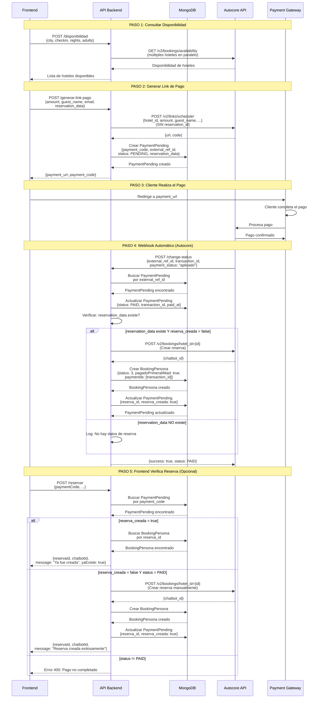

# 📊 Diagrama de Secuencia - Booking Personas

## Flujo Completo con Creación Automática de Reserva



## Estados de los Documentos en la Base de Datos

### Estado Inicial (Después de PASO 2)
```json
// payment_pending_personas
{
  "status": "pending",
  "reserva_creada": false,
  "reserva_id": null
}

// bookingpersonas
(No existe aún)
```

### Estado Final (Después de PASO 4)
```json
// payment_pending_personas
{
  "status": "paid",
  "reserva_creada": true,
  "reserva_id": "65f1a2b3c4d5e6f7g8h9i0j2",
  "transaction_id": "TXN-ABC123XYZ789",
  "paid_at": "2025-01-22T10:35:00.000Z"
}

// bookingpersonas
{
  "_id": "65f1a2b3c4d5e6f7g8h9i0j2",
  "status": 3,  // Pago Aprobado
  "pagadoPrimeraMitad": true,
  "paymenIds": ["TXN-ABC123XYZ789"],
  "reservaChatbotId": "BK-00230690"
}
```

