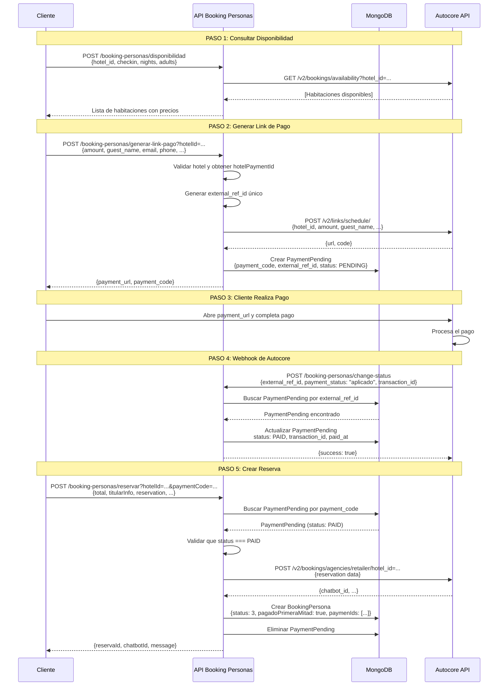
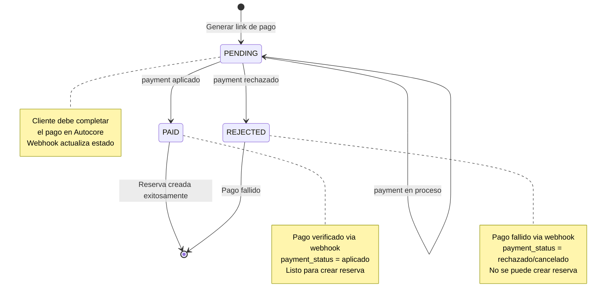
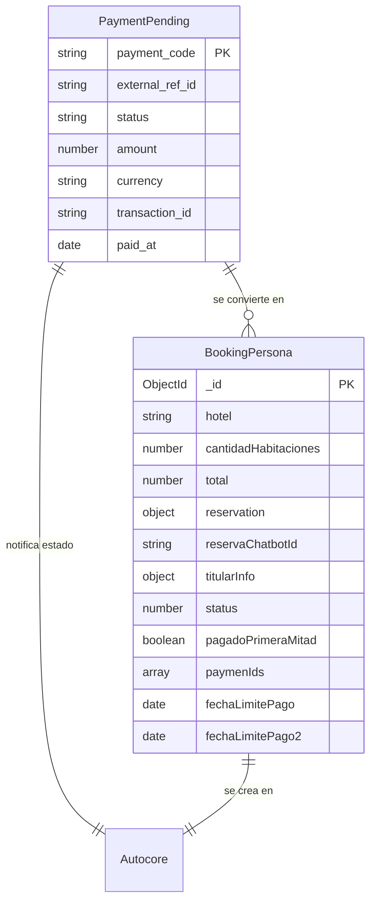
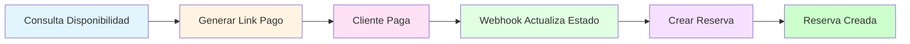

# Flujo de Booking Personas - Diagrama Mermaid

## Diagrama de Flujo Completo

```mermaid
flowchart TD
    Start([Cliente inicia proceso]) --> ConsultaDisponibilidad[POST /booking-personas/disponibilidad<br/>Body: hotel_id, checkin, nights, adults, children_ages]
    
    ConsultaDisponibilidad --> ValidarDisponibilidad{Validar DTO}
    ValidarDisponibilidad -->|Error| ErrorDisponibilidad[Error 400: Datos inválidos]
    ValidarDisponibilidad -->|OK| LlamarAutocoreDisponibilidad[Llamar Autocore API<br/>GET /v2/bookings/availability]
    
    LlamarAutocoreDisponibilidad --> RespuestaDisponibilidad{Respuesta Autocore}
    RespuestaDisponibilidad -->|Error| ErrorAutocoreDisponibilidad[Error: Sin disponibilidad]
    RespuestaDisponibilidad -->|OK| RetornarDisponibilidad[Retornar habitaciones disponibles<br/>con precios]
    
    RetornarDisponibilidad --> ClienteSelecciona[Cliente selecciona habitación<br/>y calcula monto total]
    
    ClienteSelecciona --> GenerarLinkPago[POST /booking-personas/generar-link-pago<br/>Query: hotelId<br/>Body: amount, currency, guest_name, email, phone, booking_dates, description]
    
    GenerarLinkPago --> ValidarHotel{Validar Hotel}
    ValidarHotel -->|No existe| ErrorHotel[Error 400: Hotel no encontrado]
    ValidarHotel -->|OK| ObtenerHotelPaymentId[Obtener hotelPaymentId<br/>de hotelesAutocorePaymenLink]
    
    ObtenerHotelPaymentId --> GenerarExternalRefId[Generar external_ref_id único<br/>personas_timestamp_random]
    
    GenerarExternalRefId --> CrearLinkAutocore[Llamar Autocore API<br/>POST /v2/links/schedule/<br/>con datos del pago]
    
    CrearLinkAutocore --> RespuestaLink{Respuesta Autocore}
    RespuestaLink -->|Error| ErrorCrearLink[Error 500: Error al generar link]
    RespuestaLink -->|OK| GuardarPaymentPending[Guardar PaymentPending en MongoDB<br/>payment_code, external_ref_id<br/>status: PENDING, amount, currency]
    
    GuardarPaymentPending --> RetornarLinkPago[Retornar payment_url y payment_code<br/>al cliente]
    
    RetornarLinkPago --> ClientePaga[Cliente abre payment_url<br/>y realiza el pago]
    
    ClientePaga --> AutocoreProcesa[Autocore procesa el pago]
    
    AutocoreProcesa --> WebhookAutocore[Webhook Autocore<br/>POST /booking-personas/change-status<br/>Body: external_ref_id, transaction_id, payment_status]
    
    WebhookAutocore --> BuscarPaymentPending[Buscar PaymentPending<br/>por external_ref_id]
    
    BuscarPaymentPending --> Encontrado{¿Encontrado?}
    Encontrado -->|No| LogWarning[Log: Pago pendiente no encontrado]
    Encontrado -->|Sí| VerificarEstado{payment_status}
    
    VerificarEstado -->|aplicado| ActualizarPAID[Actualizar PaymentPending<br/>status: PAID<br/>transaction_id, paid_at]
    VerificarEstado -->|rechazado/cancelado| ActualizarREJECTED[Actualizar PaymentPending<br/>status: REJECTED]
    VerificarEstado -->|en proceso| MantenerPENDING[Mantener status: PENDING]
    
    ActualizarPAID --> ClienteCreaReserva[Cliente llama a crear reserva<br/>POST /booking-personas/reservar<br/>Query: hotelId, paymentCode<br/>Body: total, titularInfo, reservation, etc.]
    
    ActualizarREJECTED --> ErrorPagoRechazado[Error: Pago rechazado]
    MantenerPENDING --> EsperarPago[Esperar confirmación de pago]
    
    ClienteCreaReserva --> ValidarPaymentCode{Validar paymentCode}
    ValidarPaymentCode -->|No proporcionado| ErrorSinCodigo[Error 400: Código de pago requerido]
    ValidarPaymentCode -->|Proporcionado| BuscarPagoPendiente[Buscar PaymentPending<br/>por payment_code]
    
    BuscarPagoPendiente --> PagoEncontrado{¿Encontrado?}
    PagoEncontrado -->|No| ErrorCodigoNoEncontrado[Error 400: Código de pago no encontrado]
    PagoEncontrado -->|Sí| VerificarEstadoPago{status === PAID?}
    
    VerificarEstadoPago -->|No| ErrorPagoNoCompletado[Error 400: Pago no completado<br/>Estado actual: PENDING/REJECTED]
    VerificarEstadoPago -->|Sí| ValidarDatosReserva[Validar datos de reserva<br/>hotel, fechas, habitaciones]
    
    ValidarDatosReserva --> CalcularFechasLimite[Calcular fechas límite de pago<br/>isReservaGrupo >= 10 habitaciones]
    
    CalcularFechasLimite --> CrearReservaAutocore[Llamar Autocore API<br/>POST /v2/bookings/agencies/retailer/hotel_id=...<br/>Body: reservation data]
    
    CrearReservaAutocore --> RespuestaReservaAutocore{Respuesta Autocore}
    RespuestaReservaAutocore -->|Error| ErrorCrearReservaAutocore[Error: No hay habitaciones disponibles<br/>o error en Autocore]
    RespuestaReservaAutocore -->|OK| GuardarReservaMongoDB[Guardar BookingPersona en MongoDB<br/>status: 3 Pago Aprobado<br/>pagadoPrimeraMitad: true<br/>paymenIds: transaction_id]
    
    GuardarReservaMongoDB --> EliminarPaymentPending[Eliminar PaymentPending<br/>ya procesado]
    
    EliminarPaymentPending --> RetornarReservaExitosa[Retornar respuesta exitosa<br/>reservaId, chatbotId<br/>message: Reserva creada con pago completo]
    
    RetornarReservaExitosa --> End([Reserva creada exitosamente])
    
    %% Estilos
    classDef errorClass fill:#ffcccc,stroke:#ff0000,stroke-width:2px
    classDef successClass fill:#ccffcc,stroke:#00ff00,stroke-width:2px
    classDef processClass fill:#cce5ff,stroke:#0066cc,stroke-width:2px
    classDef decisionClass fill:#fff4cc,stroke:#ffcc00,stroke-width:2px
    
    class ErrorDisponibilidad,ErrorAutocoreDisponibilidad,ErrorHotel,ErrorCrearLink,ErrorPagoRechazado,ErrorSinCodigo,ErrorCodigoNoEncontrado,ErrorPagoNoCompletado,ErrorCrearReservaAutocore errorClass
    class RetornarDisponibilidad,RetornarLinkPago,ActualizarPAID,GuardarReservaMongoDB,RetornarReservaExitosa,End successClass
    class ConsultaDisponibilidad,GenerarLinkPago,ClientePaga,WebhookAutocore,ClienteCreaReserva,CrearReservaAutocore processClass
    class ValidarDisponibilidad,RespuestaDisponibilidad,ValidarHotel,RespuestaLink,Encontrado,VerificarEstado,ValidarPaymentCode,PagoEncontrado,VerificarEstadoPago,RespuestaReservaAutocore decisionClass
```

## Diagrama de Secuencia

## Diagrama de Estados del Pago

## Diagrama de Entidades y Relaciones

## Flujo Simplificado (Vista General)

