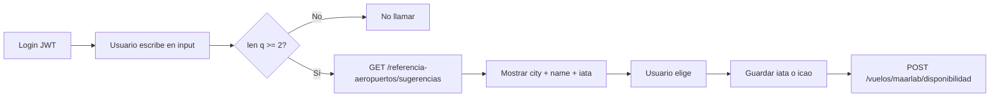

# Manual de integración — Consulta de aeropuertos y ciudades por nombre

**Versión:** 2.0  
**Base URL:** `{HOST}/agencias/v1/`  
**Fuente de datos:** Colección MongoDB `aeropuertos_referencia` (catálogo local precargado)

---

## 1. Resumen

La búsqueda predictiva de aeropuertos (y por extensión **ciudades**, vía el campo `city` de cada aeropuerto) se hace contra un **catálogo local en MongoDB**, no contra Amadeus en tiempo real.

| | |
|--|--|
| **Método** | `GET` |
| **Ruta** | `/referencia-aeropuertos/sugerencias` |
| **Autenticación** | **JWT obligatorio** (`Authorization: Bearer <token>`) |
| **Colección** | `aeropuertos_referencia` |
| **Módulo** | `referencia-aeropuertos` |

Ventajas frente a APIs externas: respuesta rápida, caché en memoria (~45 s), sin depender de Amadeus para el autocompletado.

---

## 2. Autenticación

Obtener token:

```http
POST /agencias/v1/auth/sign-in
Content-Type: application/json

{ "email": "usuario@agencia.com", "password": "..." }
```

Todas las llamadas a este módulo deben incluir:

```http
Authorization: Bearer <accessToken>
```

Sin JWT → `401 Unauthorized`.

---

## 3. Parámetros de consulta

| Parámetro | Tipo | Requerido | Default | Descripción |
|-----------|------|-----------|---------|-------------|
| `q` | string | **Sí** | — | Texto a buscar (1–80 caracteres). Nombre de aeropuerto, **ciudad**, código **IATA** o **ICAO**. |
| `country` | string | No | — | Filtro por país: ISO 3166-1 **alpha-2**, exactamente 2 letras (ej. `CO`, `US`, `ES`). |
| `limit` | number | No | `20` | Cantidad máxima de resultados (1–50). |

### Cómo interpreta el servidor el texto `q`

| Entrada `q` | Comportamiento |
|-------------|----------------|
| **Sin espacios** (ej. `bog`, `CTG`, `cart`) | Búsqueda por **prefijo** en: nombre normalizado, ciudad normalizada, IATA (si 2–3 letras) e ICAO. |
| **Con espacios** (ej. `el dorado`, `santa marta`) | Primero intenta búsqueda **full-text** en MongoDB (`name`, `city`, `iata`, `icao`). Si no hay resultados, cae al modo prefijo. |

### Validación

- `q` vacío o ausente → `400 Bad Request`
- `q` mayor a 80 caracteres → `400`
- `country` distinto de 2 letras → `400`
- `limit` fuera de 1–50 → `400`

---

## 4. Ejemplos de uso

### 4.1 Por nombre de ciudad

```http
GET /agencias/v1/referencia-aeropuertos/sugerencias?q=Cartagena&country=CO&limit=10
Authorization: Bearer <token>
```

Devuelve aeropuertos cuya **ciudad** o **nombre** coincidan con el prefijo/texto (ej. Rafael Núñez en Cartagena).

### 4.2 Por nombre de aeropuerto

```http
GET /agencias/v1/referencia-aeropuertos/sugerencias?q=El%20Dorado&country=CO&limit=10
```

Con espacio → modo full-text.

### 4.3 Autocompletado (usuario escribe “Bog”)

```http
GET /agencias/v1/referencia-aeropuertos/sugerencias?q=Bog&country=CO&limit=5
```

**UX recomendado:** debounce 300–500 ms, mínimo 2 caracteres antes de llamar.

### 4.4 Por código IATA

```http
GET /agencias/v1/referencia-aeropuertos/sugerencias?q=BOG&limit=5
```

### 4.5 Sin filtro de país (búsqueda global)

```http
GET /agencias/v1/referencia-aeropuertos/sugerencias?q=Madrid&limit=15
```

Omitir `country` para no restringir por país.

### 4.6 cURL completo

```bash
curl -G "{HOST}/agencias/v1/referencia-aeropuertos/sugerencias" \
  -H "Authorization: Bearer <TOKEN>" \
  --data-urlencode "q=Cartagena" \
  --data-urlencode "country=CO" \
  --data-urlencode "limit=10"
```

---

## 5. Respuesta exitosa (200 OK)

```json
{
  "count": 2,
  "data": [
    {
      "icao": "SKCG",
      "iata": "CTG",
      "name": "Rafael Nunez Intl",
      "city": "Cartagena",
      "state": "",
      "country": "CO",
      "lat": 10.442381,
      "lon": -75.512961,
      "tz": "America/Bogota"
    }
  ]
}
```

### Campos de cada ítem (`AeropuertoSugerenciaDto`)

| Campo | Tipo | Uso en el front |
|-------|------|-----------------|
| `iata` | string \| null | Código para vuelos (`origin` / `destination` en MaarLab). Puede ser `null` en aeródromos sin IATA comercial. |
| `icao` | string | Identificador único en el catálogo (siempre presente). |
| `name` | string | Nombre del aeropuerto |
| `city` | string | Ciudad — usar para mostrar “Ciudad, Aeropuerto” |
| `state` | string | Estado/región (puede ir vacío) |
| `country` | string | País ISO2 |
| `lat`, `lon` | number \| null | Mapa / geolocalización |
| `tz` | string | Zona horaria (ej. `America/Bogota`) |

### Etiqueta sugerida en UI

```text
{city} — {name} ({iata ?? icao})
```

Ejemplo: `Cartagena — Rafael Nunez Intl (CTG)`

### Lista vacía

`count: 0` y `data: []` → sin coincidencias. Probar sin `country`, más caracteres en `q`, o revisar que el catálogo esté cargado (sección 7).

### Caché HTTP

La respuesta incluye:

```http
Cache-Control: private, max-age=60, stale-while-revalidate=120
```

El servidor además cachea en memoria ~45 s por combinación `q|country|limit`.

---

## 6. Endpoint auxiliar — estado del catálogo

| | |
|--|--|
| **Método** | `GET` |
| **Ruta** | `/referencia-aeropuertos/estado` |
| **Auth** | JWT obligatorio |

**Respuesta:**

```json
{ "count": 29305 }
```

`count` = documentos estimados en `aeropuertos_referencia`. Útil después del seed para confirmar que la colección tiene datos.

```bash
curl "{HOST}/agencias/v1/referencia-aeropuertos/estado" \
  -H "Authorization: Bearer <TOKEN>"
```

Si `count` es `0`, ejecutar la carga inicial (sección 7) antes de usar sugerencias.

---

## 7. Carga y mantenimiento del catálogo

Los datos **no** se insertan por API; se cargan con script:

```bash
npm run seed:airports
```

Solo recrear índices:

```bash
npm run seed:airports:indexes
```

Script: `scripts/seed-airports.ts`  
Modelo: `src/referencia-aeropuertos/entities/aeropuerto-referencia.entity.ts`

Cada documento guarda aeropuerto + ciudad (`city`, `normCity`). No existe colección separada de ciudades: buscar por ciudad es buscar aeropuertos cuyo campo `city` coincide.

---

## 8. Flujo recomendado en el cliente



1. `POST /auth/sign-in` → token.  
2. Debounce en input; `GET .../sugerencias?q=...&country=CO&limit=20`.  
3. Mostrar `city`, `name` y código (`iata` preferido).  
4. Si `iata` es `null`, valorar usar `icao` o pedir otro aeropuerto con IATA para MaarLab.  
5. Usar `iata` en búsqueda de vuelos.

---

## 9. Ejemplo integrado (JavaScript)

```javascript
const BASE = '{HOST}/agencias/v1';

async function buscarAeropuertosPorNombre(token, texto, pais = 'CO', limit = 20) {
  const params = new URLSearchParams({
    q: texto,
    limit: String(limit),
  });
  if (pais) params.set('country', pais);

  const res = await fetch(
    `${BASE}/referencia-aeropuertos/sugerencias?${params}`,
    {
      headers: { Authorization: `Bearer ${token}` },
    },
  );

  if (!res.ok) {
    const err = await res.json().catch(() => ({}));
    throw new Error(err.message || `HTTP ${res.status}`);
  }

  const { data } = await res.json();
  return data.map((a) => ({
    label: `${a.city} — ${a.name}${a.iata ? ` (${a.iata})` : ` [${a.icao}]`}`,
    iata: a.iata,
    icao: a.icao,
    city: a.city,
    country: a.country,
    lat: a.lat,
    lon: a.lon,
  }));
}

// Uso tras login
const opciones = await buscarAeropuertosPorNombre(accessToken, 'Cartagena', 'CO');
```

---

## 10. Errores frecuentes

| Síntoma | Causa | Solución |
|---------|--------|----------|
| `401` | Sin JWT o token expirado | `POST /auth/sign-in` y reenviar header |
| `400` en `q` | Parámetro vacío o > 80 chars | Validar en cliente antes de llamar |
| `400` en `country` | No son 2 letras | Enviar `CO`, no `Colombia` |
| Siempre `data: []` | Colección vacía | `GET .../estado` y `npm run seed:airports` |
| Usar `/vuelos/ubicaciones` | Endpoint distinto (Amadeus) | Para catálogo local usar **`/referencia-aeropuertos/sugerencias`** |
| MaarLab falla sin IATA | Aeropuerto sin código IATA en catálogo | Elegir resultado con `iata` no nulo |

---

## 11. Códigos HTTP

| Código | Significado |
|--------|-------------|
| `200` | OK (`count` puede ser 0) |
| `400` | Validación de query (`q`, `country`, `limit`) |
| `401` | JWT ausente o inválido |
| `429` | Throttle (límite ~200 req/min en `sugerencias`) |
| `500` | Error interno / MongoDB |

---

## 12. Modelo de datos (referencia)

Colección `aeropuertos_referencia` — campos principales:

| Campo | Descripción |
|-------|-------------|
| `icao` | Código ICAO (único, requerido) |
| `iata` | Código IATA comercial (opcional; ausente si no aplica) |
| `name` | Nombre del aeropuerto |
| `city` | Ciudad |
| `state` | Estado/provincia |
| `country` | País ISO2 |
| `lat`, `lon`, `tz` | Geografía y zona horaria |
| `normName`, `normCity` | Normalizados para búsqueda por prefijo (interno) |

Índices: texto en `name`, `city`, `iata`, `icao`; prefijos por país + nombre/ciudad.

---

## 13. Referencias en código

| Elemento | Archivo |
|----------|---------|
| Controlador | `src/referencia-aeropuertos/referencia-aeropuertos.controller.ts` |
| Servicio / lógica búsqueda | `src/referencia-aeropuertos/referencia-aeropuertos.service.ts` |
| DTO query | `src/referencia-aeropuertos/dto/airport-suggest-query.dto.ts` |
| DTO respuesta | `src/referencia-aeropuertos/dto/aeropuerto-sugerencia.dto.ts` |
| Entidad MongoDB | `src/referencia-aeropuertos/entities/aeropuerto-referencia.entity.ts` |
| Seed | `scripts/seed-airports.ts` |

---

## Anexo — Alternativa externa (Amadeus)

Si en algún flujo necesitas datos en vivo de Amadeus (no el catálogo local):

| Ruta | Auth | Notas |
|------|------|-------|
| `GET /vuelos/ubicaciones?keyword=...&subType=AIRPORT` | No JWT | API Amadeus Reference Data |

Para autocompletado de la app de agencias, el endpoint oficial del proyecto es **`GET /referencia-aeropuertos/sugerencias`**.

---

*Documento v2 — catálogo local `aeropuertos_referencia`.*
