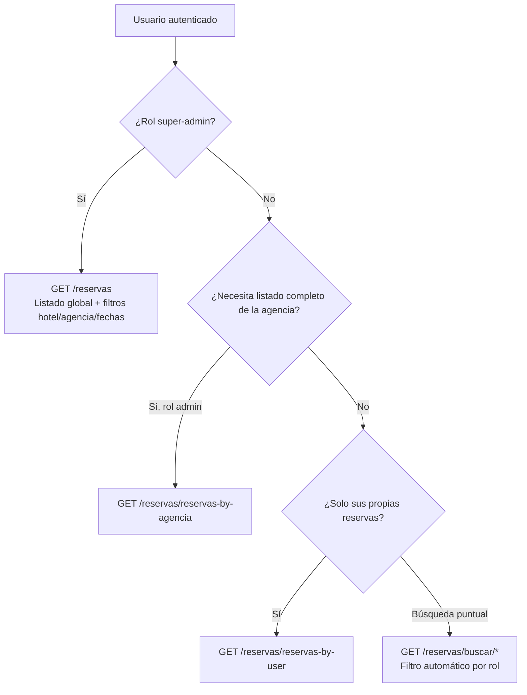

# Manual de consulta de reservas por rol

**Versión:** 1.0  
**Base URL API Agencias:** `{HOST}/agencias/v1/`  
**Módulo:** `reservas`  
**Autenticación:** JWT en todos los endpoints descritos (`Authorization: Bearer <accessToken>`)

Este documento explica **qué reservas puede ver cada rol**, **qué endpoint usar** y **cómo el backend aplica los filtros** al listar o buscar reservas.

---

## 1. Roles y alcance de datos

Los roles relevantes para consultas están definidos en `ValidRoles`:

| Rol en JWT (`user.role[]`) | Valor | Alcance de lectura |
|----------------------------|-------|---------------------|
| Agente / usuario estándar | `user` | Solo reservas donde `userId` = su propio usuario |
| Administrador de agencia | `admin` | Todas las reservas de su agencia (`agenciaId` del token) |
| Super administrador | `super-admin` | Todas las reservas del sistema (sin filtro por agencia ni usuario) |

> **Nota:** Si un usuario tiene varios roles en el array (por ejemplo `admin` y `super-admin`), en las **búsquedas** prevalece el de mayor alcance: primero se evalúa `super-admin`, luego `admin`, y por último `user`.

El rol `eventos-super-admin` **no** tiene reglas propias en consultas de reservas: se comporta como `user` (solo sus reservas) en los endpoints que usan `construirFiltroPorRol`.

### Filtro base en búsquedas (`construirFiltroPorRol`)

En los endpoints bajo `GET /reservas/buscar/*`, el servicio aplica automáticamente:

| Rol | Filtro MongoDB aplicado |
|-----|-------------------------|
| `super-admin` | `{}` (sin restricción) |
| `admin` | `{ agenciaId: <agencia del JWT> }` |
| `user` (y demás) | `{ userId: <_id del JWT> }` |

Los IDs se comparan con compatibilidad legacy (ObjectId y string).

---

## 2. ¿Qué endpoint usar según el rol?



### Resumen rápido

| Necesidad | `user` | `admin` | `super-admin` |
|-----------|--------|---------|---------------|
| Mis reservas (paginado) | `GET /reservas/reservas-by-user` | ✅ (solo las suyas como agente) | ✅ (solo las suyas como agente) |
| Todas las reservas de mi agencia | ❌ 403 en `reservas-by-agencia` | `GET /reservas/reservas-by-agencia` | Usar `GET /reservas` o búsquedas |
| Todas las reservas del sistema | ❌ | ❌ | `GET /reservas` |
| Buscar por chatbot ID, huésped, estado, etc. | `buscar/*` (solo sus reservas) | `buscar/*` (toda la agencia) | `buscar/*` (sin límite) |

### Importante: `reservas-by-user` vs `reservas-by-agencia`

- **`reservas-by-user`** filtra **únicamente** por el `_id` del JWT. Un `admin` que llame este endpoint verá **solo las reservas que él creó**, no las de otros agentes de la agencia.
- Para ver **toda la agencia**, un `admin` debe usar **`reservas-by-agencia`** o las rutas **`buscar/*`**.

---

## 3. Autenticación

```http
POST /agencias/v1/auth/sign-in
Content-Type: application/json

{
  "email": "usuario@agencia.com",
  "password": "su-password"
}
```

Respuesta: `accessToken`. Usarlo en todas las peticiones:

```http
Authorization: Bearer <accessToken>
```

---

## 4. Endpoints de listado

### 4.1 Reservas del usuario autenticado

| | |
|---|---|
| **Método y ruta** | `GET /agencias/v1/reservas/reservas-by-user` |
| **Roles en guard** | Cualquier usuario autenticado (`@Auth()` sin rol específico) |
| **Filtro real** | `userId` = `_id` del JWT |
| **Query** | `page` (opcional, default `1`) |

**Ejemplo — agente (`user`):**

```http
GET /agencias/v1/reservas/reservas-by-user?page=1
Authorization: Bearer <token_agente>
```

**Ejemplo — admin viendo solo sus propias reservas:**

```http
GET /agencias/v1/reservas/reservas-by-user?page=1
Authorization: Bearer <token_admin>
```

> Si el admin necesita el listado de **toda la agencia**, no use este endpoint; use `reservas-by-agencia`.

---

### 4.2 Reservas de la agencia (solo admin)

| | |
|---|---|
| **Método y ruta** | `GET /agencias/v1/reservas/reservas-by-agencia` |
| **Roles en guard** | Solo `admin` en `user.role` |
| **Filtro real** | `agenciaId` = `agencia` del JWT |
| **Query** | `page` (opcional) |

**Ejemplo:**

```http
GET /agencias/v1/reservas/reservas-by-agencia?page=2
Authorization: Bearer <token_admin>
```

**Errores:**

| Código | Causa |
|--------|--------|
| `403` | El usuario no tiene rol `admin` |
| `401` | Token inválido o ausente |

> Un `super-admin` **sin** rol `admin` en el array también recibe `403` en este endpoint. Para listado global debe usar `GET /reservas`.

---

### 4.3 Todas las reservas (solo super-admin)

| | |
|---|---|
| **Método y ruta** | `GET /agencias/v1/reservas` |
| **Roles en guard** | Solo `super-admin` |
| **Filtro real** | Sin filtro por rol; opcionalmente filtros de query |
| **Query** | Ver tabla siguiente |

| Parámetro | Tipo | Descripción |
|-----------|------|-------------|
| `page` | number | Página (15 registros por página) |
| `all` | `true` \| `1` | Si se envía, devuelve **todas** las coincidencias sin paginar |
| `hotel` | string | Filtro parcial case-insensitive sobre `hotel` |
| `nombreAgencia` | string | Busca agencias por nombre y filtra por sus `_id` |
| `fechaDesde` | `YYYY-MM-DD` | Filtro sobre `reservation.checkin` |
| `fechaHasta` | `YYYY-MM-DD` | Filtro sobre `reservation.checkin` (rango con `fechaDesde`) |

**Ejemplo — listado paginado con filtros:**

```http
GET /agencias/v1/reservas?page=1&hotel=Cartagena&nombreAgencia=Viajes&fechaDesde=2026-06-01&fechaHasta=2026-06-30
Authorization: Bearer <token_super_admin>
```

**Ejemplo — exportar todo (sin paginación):**

```http
GET /agencias/v1/reservas?all=true&hotel=Hilton
Authorization: Bearer <token_super_admin>
```

La respuesta incluye `meta.sumaTotalesNoCanceladas` (agregado global de reservas no canceladas, con caché interno).

---

## 5. Endpoints de búsqueda (`buscar/*`)

Todos requieren JWT (`@Auth()`). El alcance lo define `construirFiltroPorRol` (sección 1).

**Parámetros comunes de paginación:**

| Parámetro | Descripción |
|-----------|-------------|
| `page` | Página (default `1`, tamaño `15`) |
| `all` | `true` o `1` → sin `limit`, devuelve todos los resultados del filtro |

**Respuesta típica:**

```json
{
  "data": [ /* reservas con agenciaId y userId poblados */ ],
  "meta": {
    "total": 42,
    "page": 1,
    "pageSize": 15,
    "totalPages": 3,
    "sumaTotales": 12500000
  }
}
```

Con `all=true`, `meta` omite `page`, `pageSize` y `totalPages`, pero puede incluir `sumaTotales`.

> **Límite de paginación:** el `skip` máximo es 10 000 registros; páginas muy altas dejan de avanzar en el listado.

---

### 5.1 Por `reservaChatbotId`

| | |
|---|---|
| **Ruta** | `GET /agencias/v1/reservas/buscar/chatbot-id` |
| **Query** | `reservaChatbotId` (requerido) |
| **Paginación** | No aplica (0 o 1 resultado) |

| Rol | Comportamiento |
|-----|----------------|
| `user` | Solo si la reserva es suya |
| `admin` | Cualquier reserva de su agencia con ese ID |
| `super-admin` | Cualquier reserva del sistema |

```http
GET /agencias/v1/reservas/buscar/chatbot-id?reservaChatbotId=ABC-12345
Authorization: Bearer <token>
```

Respuesta: `{ "data": <reserva|null>, "found": true|false, "sumaTotales": ... }`.

---

### 5.2 Por nombre del agente

| | |
|---|---|
| **Ruta** | `GET /agencias/v1/reservas/buscar/agente` |
| **Query** | `nombre` (requerido), `page`, `all` |

Lógica adicional sobre usuarios (`User.fullName`):

| Rol | Búsqueda de agentes |
|-----|---------------------|
| `super-admin` | Cualquier usuario cuyo nombre coincida |
| `admin` | Solo usuarios de su agencia |
| `user` | Solo su propio usuario (`_id` del JWT) |

Luego se cruzan los `userId` encontrados con el filtro de rol en reservas.

```http
GET /agencias/v1/reservas/buscar/agente?nombre=María&page=1
Authorization: Bearer <token_admin>
```

---

### 5.3 Por nombre de agencia

| | |
|---|---|
| **Ruta** | `GET /agencias/v1/reservas/buscar/agencia` |
| **Query** | `nombre` (requerido), `page`, `all` |

| Rol | Búsqueda de agencias |
|-----|----------------------|
| `super-admin` | Cualquier agencia por `fullName` |
| `admin` / `user` | Solo la agencia del JWT (`_id` fijado) |

```http
GET /agencias/v1/reservas/buscar/agencia?nombre=Geh&all=true
Authorization: Bearer <token_admin>
```

Para `user`, el nombre solo sirve si coincide con su agencia; el filtro de reservas sigue limitado a las suyas (`userId`).

---

### 5.4 Por nombre del huésped

| | |
|---|---|
| **Ruta** | `GET /agencias/v1/reservas/buscar/huesped` |
| **Query** | `nombre` (requerido), `page`, `all` |

Busca en `reservation.firstName`, `reservation.lastName` y combinaciones (nombre completo). El filtro de rol se aplica encima:

| Rol | Reservas devueltas |
|-----|-------------------|
| `user` | Solo las suyas que coincidan con el huésped |
| `admin` | De toda su agencia |
| `super-admin` | De todo el sistema |

```http
GET /agencias/v1/reservas/buscar/huesped?nombre=Juan%20Pérez&page=1
Authorization: Bearer <token>
```

---

### 5.5 Por estado de pago

| | |
|---|---|
| **Ruta** | `GET /agencias/v1/reservas/buscar/estado` |
| **Query** | `status` (requerido, entero 0–6), `page`, `all` |

**Valores de `status`:**

| Valor | Estado |
|-------|--------|
| `0` | Espera de pago |
| `1` | En proceso |
| `2` | Rechazado |
| `3` | Pago total |
| `4` | Cancelado |
| `5` | Primera mitad pagada |
| `6` | Reserva abonada |

```http
GET /agencias/v1/reservas/buscar/estado?status=3&page=1
Authorization: Bearer <token_admin>
```

---

## 6. Matriz de decisión para integradores frontend

| Pantalla / caso de uso | Rol recomendado | Endpoint |
|------------------------|-----------------|----------|
| “Mis reservas” del agente | `user` | `reservas-by-user` |
| Panel admin “Reservas de la agencia” | `admin` | `reservas-by-agencia` |
| Backoffice global | `super-admin` | `GET /reservas` |
| Buscar reserva por código chatbot | Todos (con filtro) | `buscar/chatbot-id` |
| Filtrar por agente en agencia | `admin` | `buscar/agente` |
| Filtrar por agente (solo yo) | `user` | `buscar/agente` con su nombre o `reservas-by-user` |
| Reporte por estado en agencia | `admin` | `buscar/estado?status=N` |
| Reporte global por hotel/fechas | `super-admin` | `GET /reservas?hotel=...&fechaDesde=...` |

---

## 7. Formato de respuesta y campos poblados

Los listados y búsquedas devuelven documentos de reserva con:

- `agenciaId` poblado: `fullName`, `_id`, `emailContacto` (en búsquedas y `reservas-by-user`)
- `userId` poblado: `fullName`, `email`

Orden: `createdAt` descendente.

En respuestas HTTP de reservas, `reservation.roomsData[].id` se expone como **`room_id`** (interceptor de respuesta); internamente el documento puede seguir teniendo `id`.

---

## 8. Errores frecuentes

| HTTP | Mensaje / situación | Solución |
|------|---------------------|----------|
| `401` | No autorizado | Renovar JWT con `sign-in` |
| `403` | `needs a valid Role` | Usuario sin el rol exigido en el endpoint (ej. `reservas-by-agencia` sin `admin`) |
| `400` | Parámetro requerido ausente | Enviar `reservaChatbotId`, `nombre`, `status`, etc. |
| `400` | `fechaDesde` / `fechaHasta` inválidas | Formato estricto `YYYY-MM-DD` en `GET /reservas` |
| `200` + `data: []` | Sin resultados en alcance del rol | Normal: el filtro de rol excluyó reservas fuera de permiso |

---

## 9. Ejemplos por rol (flujo completo)

### Agente (`user`)

```http
# Listado de mis reservas
GET /agencias/v1/reservas/reservas-by-user?page=1

# Buscar una reserva por código (solo si es mía)
GET /agencias/v1/reservas/buscar/chatbot-id?reservaChatbotId=CHAT-999

# Reservas pagadas (solo mías)
GET /agencias/v1/reservas/buscar/estado?status=3&page=1
```

### Admin de agencia (`admin`)

```http
# Todas las reservas de la agencia
GET /agencias/v1/reservas/reservas-by-agencia?page=1

# Reservas de un agente por nombre
GET /agencias/v1/reservas/buscar/agente?nombre=Carlos&page=1

# Huésped en toda la agencia
GET /agencias/v1/reservas/buscar/huesped?nombre=García&all=true
```

### Super admin (`super-admin`)

```http
# Listado global
GET /agencias/v1/reservas?page=1&nombreAgencia=Ocean

# Misma búsqueda por chatbot sin restricción de agencia
GET /agencias/v1/reservas/buscar/chatbot-id?reservaChatbotId=CHAT-999

# Todas las canceladas del sistema
GET /agencias/v1/reservas/buscar/estado?status=4&all=true
```

---

## 10. Referencia de implementación

| Concepto | Ubicación en código |
|----------|---------------------|
| Filtro por rol en búsquedas | `ReservasService.construirFiltroPorRol()` |
| Listado por usuario | `ReservasService.getReservasByUser()` |
| Listado por agencia | `ReservasService.getReservasByAgencia()` |
| Listado global | `ReservasService.getAllReservas()` |
| Rutas y guards | `ReservasController` |
| Enum de roles | `src/auth/interfaces/valid-roles.interface.ts` |
| Estados de pago | `src/reservas/interfaces/validPaymentStatus.interface.ts` |

---

## 11. Swagger

Documentación interactiva:

`{HOST}/agencias/v1/api-docs` → tag **reservas**

Ahí se pueden probar los endpoints con JWT desde el botón **Authorize**.
