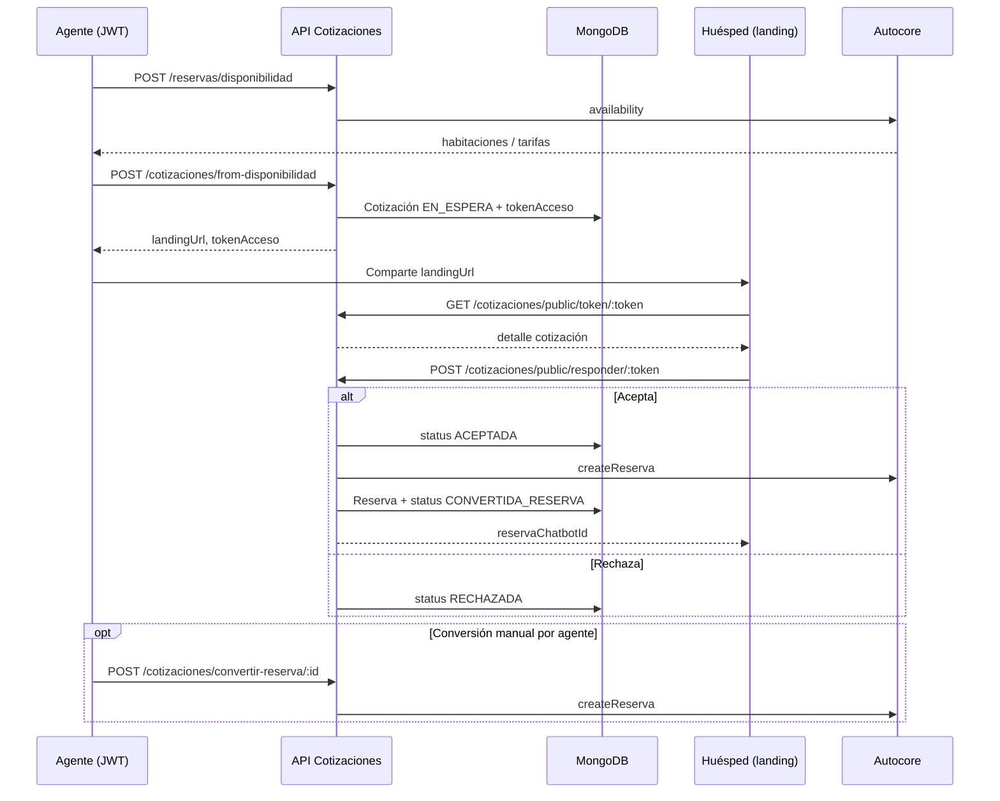

# Manual de integración — Cotizaciones

**Versión:** 1.0  
**Base URL API:** `https://gehsuitesapps.com/agencias/v1/`  
**Módulo:** `cotizaciones`  
**Colección MongoDB:** `cotizacions` (modelo `Cotizacion`)

Este documento describe el **flujo completo de cotizaciones** (crear, compartir landing, aceptar/rechazar, convertir en reserva) y cómo integrarlo desde el front o sistemas externos.

**Documentos relacionados:**

- [MANUAL_INTEGRACION_VUELO_HOTEL.md](./MANUAL_INTEGRACION_VUELO_HOTEL.md) — vuelo MaarLab + hotel (después de convertir cotización)
- [MANUAL_CONSULTA_RESERVAS_POR_ROL.md](./MANUAL_CONSULTA_RESERVAS_POR_ROL.md) — consulta de reservas por rol
- Ejemplo de payload: `ejemplo-completo-cotizacion.json` (raíz del repo)

---

## 1. Resumen del flujo

Una **cotización** es una propuesta comercial de hotel (y opcionalmente vuelo) que la agencia envía al huésped. El huésped la ve en una **landing** pública y puede **aceptar** o **rechazar**. Si acepta, el backend intenta **crear la reserva en Autocore** y guardarla en MongoDB.



---

## 2. Estados de la cotización

| Valor | Constante | Significado |
|-------|-----------|-------------|
| `0` | `EN_ESPERA` | Creada; esperando respuesta del huésped |
| `1` | `ACEPTADA` | Huésped aceptó (puede estar en proceso de crear reserva) |
| `2` | `RECHAZADA` | Huésped rechazó |
| `3` | `CONVERTIDA_RESERVA` | Reserva creada en Autocore y vinculada (`reservaId`) |

Solo se puede **responder** (`aceptar`/`rechazar`) si `status === 0` y la fecha actual es **≤ `fechaLimiteRespuesta`**.

---

## 3. Autenticación

### Endpoints privados (agente / backoffice)

```http
POST /agencias/v1/auth/sign-in
Content-Type: application/json

{ "email": "agente@agencia.com", "password": "..." }
```

En todas las rutas bajo `/cotizaciones` (excepto `/cotizaciones/public/*`):

```http
Authorization: Bearer <accessToken>
```

### Endpoints públicos (huésped / landing)

Prefijo: `/agencias/v1/cotizaciones/public/` — **sin JWT**.

| Ruta | Uso |
|------|-----|
| `GET .../public/token/:tokenAcceso` | Mostrar cotización en landing |
| `GET .../public/:id` | Consulta por `_id` Mongo (menos habitual) |
| `POST .../public/responder/:tokenAcceso` | Aceptar o rechazar |

---

## 4. Variables de entorno

| Variable | Uso |
|----------|-----|
| `FRONTEND_URL` | Base para armar `landingUrl` si no se envía en el body (ej. `https://app.tu-front.com/cotizacion/{token}`) |
| `CHROMIUM_PATH` | Ruta a Chromium para generar PDF (servidor Linux) |

---

## 5. Flujo de integración recomendado (front agencia)

### Paso 1 — Disponibilidad de hotel

Igual que reservas directas:

```http
POST /agencias/v1/reservas/disponibilidad
Authorization: Bearer <JWT>
```

Body: `checkingDate`, `nights`, `ciudad` (`CARTAGENA` | `SANTA_MARTA` | `BOGOTA`), `layout[]`.

Del resultado guardar por habitación: `roomId` → `roomsData[].id`, `rateId`, `unitaryPrice`, fechas, nombre habitación.

### Paso 2 — (Opcional) Vuelo MaarLab

Si el paquete incluye vuelo, seguir [MANUAL_INTEGRACION_VUELO_HOTEL.md](./MANUAL_INTEGRACION_VUELO_HOTEL.md) hasta tener `packageId` y `respuestaMaarLab` (sin nodo `hotel`).

### Paso 3 — Crear cotización

**Recomendado:** `POST /cotizaciones/from-disponibilidad` (rellena `hotel`, `cantidadHabitaciones`, permite `landingHtml`).

```http
POST /agencias/v1/cotizaciones/from-disponibilidad
Authorization: Bearer <JWT>
Content-Type: application/json
```

Campos mínimos obligatorios en el body (`CreateCotizacionDto`):

| Campo | Requerido | Notas |
|-------|-----------|-------|
| `total` | Sí | Monto base |
| `markup` | Sí | Porcentaje (> 0). El API calcula `montoconmarkup = total * (1 + markup/100)` |
| `porcentajemarkup` | Sí | Suele coincidir con `markup` |
| `titularInfo` | Sí | `firstName`, `lastName`, `tipoDocumento`, `documento`, `fechaNacimiento` |
| `reservaInfo.agency` | Sí | `is_agency`, `agency_type` (0\|1), `external_ref_id` |
| `reservaInfo.reservation` | Sí | Misma estructura que `CreateReservaDto` / reserva Autocore |
| `reservaInfo.reservation.roomsData[]` | Sí | Al menos una habitación con tarifa elegida |

Opcionales útiles:

| Campo | Uso |
|-------|-----|
| `fechaLimiteRespuesta` | `YYYY-MM-DD` (default: +7 días) |
| `landingHtml` | HTML completo de la landing (botones aceptar/rechazar) |
| `landingUrl` | Si se omite, se usa `{FRONTEND_URL}/cotizacion/{tokenAcceso}` |
| `hotelInfo` | `{ name, id, city, ... }` → define `hotel` en la cotización |
| `huespedInfo` / `agenciaInfo` | Solo informativos para la landing |
| `vuelo[]` | `{ packageId, respuestaMaarLab, createdAt? }` — se copia a la reserva al convertir |
| `origenIata`, `planAlimentario`, retenciones, transporte, tours, mascotas | Igual que reservas |

**Respuesta:** documento `Cotizacion` con:

- `tokenAcceso` — UUID para URL pública
- `landingUrl` — enlace para el huésped
- `status: 0`
- `_id` — ID interno

### Paso 4 — Compartir landing al huésped

Enviar `landingUrl` por email/WhatsApp. El front público debe:

1. Leer `token` de la URL.
2. `GET /cotizaciones/public/token/{token}`.
3. Renderizar `landingHtml` (si viene guardado) o armar UI con los campos de la cotización.
4. Al aceptar/rechazar: `POST /cotizaciones/public/responder/{token}`.

### Paso 5 — Respuesta del huésped

```http
POST /agencias/v1/cotizaciones/public/responder/{tokenAcceso}
Content-Type: application/json

{
  "status": 1,
  "motivoRechazo": ""
}
```

| `status` | Acción |
|----------|--------|
| `1` | **ACEPTADA** — intenta crear reserva en Autocore automáticamente |
| `2` | **RECHAZADA** — opcional `motivoRechazo` |

**Respuesta si acepta y Autocore OK:**

```json
{
  "message": "Cotización aceptada y reserva creada exitosamente",
  "cotizacion": { "...": "..." },
  "reserva": {
    "message": "Reserva creada exitosamente desde cotización",
    "reservaId": "...",
    "reservaChatbotId": "CB88D9393D",
    "cotizacionId": "..."
  }
}
```

**Si Autocore falla:** la cotización queda en `ACEPTADA` pero el body incluye `error` y mensaje para gestión manual.

### Paso 6 — Conversión manual (alternativa)

Si la cotización ya está `ACEPTADA` pero no se creó reserva (o se prefiere control del agente):

```http
POST /agencias/v1/cotizaciones/convertir-reserva/{cotizacionId}
Authorization: Bearer <JWT>
```

- Requiere `status === 1` y que no exista `reservaId`.
- Crea reserva en Autocore y Mongo; pasa a `status === 3`.
- El agente debe ser de la **misma agencia** (salvo `super-admin`).
- La reserva queda asociada al **usuario que ejecuta** la conversión (no necesariamente al que creó la cotización).

### Paso 7 — Después de la reserva

Con `reservaChatbotId`:

- Pagos hotel: `POST /reservas/generate-link`, webhooks Autocore (ver [MANUAL_INTEGRACION_PAGOS_AUTOCORE.md](./MANUAL_INTEGRACION_PAGOS_AUTOCORE.md)).
- Vuelo: flujo MaarLab con `reservaChatbotId` si se envió `vuelo[]` en la cotización (los datos se copian al documento `Reserva`).

---

## 6. Endpoints de consulta y gestión (JWT)

| Método | Ruta | Auth | Descripción |
|--------|------|------|-------------|
| `GET` | `/cotizaciones` | JWT | Lista paginada. `super-admin`: todas; resto: por `agenciaId` |
| `GET` | `/cotizaciones/:id` | JWT | Detalle por `_id` |
| `GET` | `/cotizaciones/token/:tokenAcceso` | JWT | Detalle por token |
| `GET` | `/cotizaciones/estadisticas` | JWT | Conteo por `status` de la agencia del usuario |
| `PATCH` | `/cotizaciones/:id` | JWT | Actualizar (incluye `vuelo[]`) |
| `DELETE` | `/cotizaciones/:id` | JWT | Eliminar |
| `POST` | `/cotizaciones/pdf` | JWT | Genera PDF desde `landingHtml` (Cloudinary) |

**Listado:**

```http
GET /agencias/v1/cotizaciones?page=1&limit=25
Authorization: Bearer <JWT>
```

Query: `page` (default 1), `limit` (default 25, máx. 100 en listado por agencia).

---

## 7. Payload de ejemplo (recortado)

Ver archivo completo: `ejemplo-completo-cotizacion.json`.

```json
{
  "total": 2500000,
  "markup": 20,
  "porcentajemarkup": 20,
  "titularInfo": {
    "firstName": "María",
    "lastName": "García",
    "tipoDocumento": "CC",
    "documento": "1234567890",
    "fechaNacimiento": "1990-05-15"
  },
  "reservaInfo": {
    "agency": {
      "is_agency": true,
      "agency_type": 1,
      "external_ref_id": "AG-001"
    },
    "reservation": {
      "adults": "2",
      "checkin": "2026-06-10",
      "checkout": "2026-06-17",
      "children": "0",
      "children_ages": "",
      "city": "CARTAGENA",
      "country": "COL",
      "currency": "COP",
      "email": "huesped@ejemplo.com",
      "telephone": "+573001234567",
      "firstName": "María",
      "lastName": "García",
      "nights": "7",
      "rooms": "1",
      "roomsData": [
        {
          "nombreHabitacion": "Doble estándar",
          "adults": "2",
          "children": "",
          "children_ages": "",
          "checkin": "2026-06-10",
          "checkout": "2026-06-17",
          "currency": "COP",
          "id": "room-101",
          "quantity": "1",
          "rateId": "rate-001",
          "unitaryPrice": 2500000
        }
      ]
    }
  },
  "hotelInfo": {
    "name": "Hotel Decameron Cartagena",
    "city": "CARTAGENA"
  },
  "fechaLimiteRespuesta": "2026-06-01",
  "landingHtml": "<html>...</html>",
  "vuelo": [
    {
      "packageId": "MAH-XXXX",
      "respuestaMaarLab": {
        "packageId": "MAH-XXXX",
        "totalPrice": 500
      }
    }
  ]
}
```

---

## 8. Cotización con vuelo (`vuelo[]`)

Misma estructura que `Reserva.vuelo`:

```json
"vuelo": [
  {
    "packageId": "MAH-C7GQ0G",
    "respuestaMaarLab": { },
    "createdAt": "2026-05-19T12:00:00.000Z"
  }
]
```

- Opcional al crear o actualizar (`PATCH`).
- Al **convertir a reserva**, se copia a `reserva.vuelo`.
- El pago del vuelo y el book en MaarLab se hacen **después**, con `reservaChatbotId` (ver manual vuelo+hotel).

---

## 9. Generación de PDF

```http
POST /agencias/v1/cotizaciones/pdf
Authorization: Bearer <JWT>
Content-Type: application/json

{ "cotizacionId": "664a1b2c3d4e5f6a7b8c9d0" }
```

- Requiere `landingHtml` guardado en la cotización.
- Usa Puppeteer + subida a Cloudinary.
- Devuelve URL del PDF (`pdfUrl`); si ya existía, reutiliza la misma URL.

---

## 10. Reglas de negocio importantes

1. **Hotel en Autocore:** al convertir, el nombre `cotizacion.hotel` debe coincidir con un hotel en `hotelesAutocore` (config). Si no hay match → `400`.
2. **Verificación de disponibilidad al convertir:** actualmente **omitida** (comentario en código: errores 500 de Autocore). La reserva se intenta crear directamente.
3. **Reserva de grupo:** si `cantidadHabitaciones >= 10`, aplican reglas especiales de `fechaLimitePago` (igual que reservas).
4. **`reservaInfo.agency` en conversión:** `agency_type` numérico del DTO se transforma a `wholesale` / `retailer` para Autocore; `external_ref_id` usa `cobreInfo.bolcilloId` de la agencia cuando existe.
5. **Responder con JWT:** existe `POST /cotizaciones/responder/:token` con `@Auth()`; el flujo del huésped debe usar la ruta **pública** sin token.

---

## 11. Errores frecuentes

| HTTP | Situación | Qué hacer |
|------|-----------|-----------|
| `400` | Falta `reservaInfo.reservation` | Completar bloque `reservation` |
| `400` | Cotización ya respondida | Solo `EN_ESPERA` admite respuesta |
| `400` | Cotización expirada | `fechaLimiteRespuesta` pasada |
| `400` | Hotel no encontrado al convertir | Verificar nombre vs `hotelesAutocore` |
| `400` | Ya convertida / no aceptada | Revisar `status` y `reservaId` |
| `403` | Convertir cotización de otra agencia | Solo misma agencia (o super-admin) |
| `404` | Token o ID inválido | Verificar `tokenAcceso` |

---

## 12. Matriz rápida para el front

| Pantalla | Endpoint |
|----------|----------|
| Listado agencia | `GET /cotizaciones?page=&limit=` |
| Detalle backoffice | `GET /cotizaciones/:id` |
| Landing huésped (cargar) | `GET /cotizaciones/public/token/:token` |
| Aceptar / rechazar huésped | `POST /cotizaciones/public/responder/:token` |
| Crear desde disponibilidad | `POST /cotizaciones/from-disponibilidad` |
| Forzar reserva | `POST /cotizaciones/convertir-reserva/:id` |
| Descargar PDF | `POST /cotizaciones/pdf` |
| Dashboard estados | `GET /cotizaciones/estadisticas` |

---

## 13. Referencia de código

| Concepto | Archivo |
|----------|---------|
| Entidad y estados | `src/cotizaciones/entities/cotizacion.entity.ts` |
| DTO crear | `src/cotizaciones/dto/create-cotizacion.dto.ts` |
| DTO responder | `src/cotizaciones/dto/responder-cotizacion.dto.ts` |
| Lógica de negocio | `src/cotizaciones/cotizaciones.service.ts` |
| API privada | `src/cotizaciones/cotizaciones.controller.ts` |
| API pública | `src/cotizaciones/cotizaciones-public.controller.ts` |
| Conversión → Autocore | `convertirAReservaAutomatica()` en `cotizaciones.service.ts` |

---

## 14. Swagger

`https://gehsuitesapps.com/agencias/v1/api-docs` → tags **cotizaciones** y **cotizaciones-public**.
