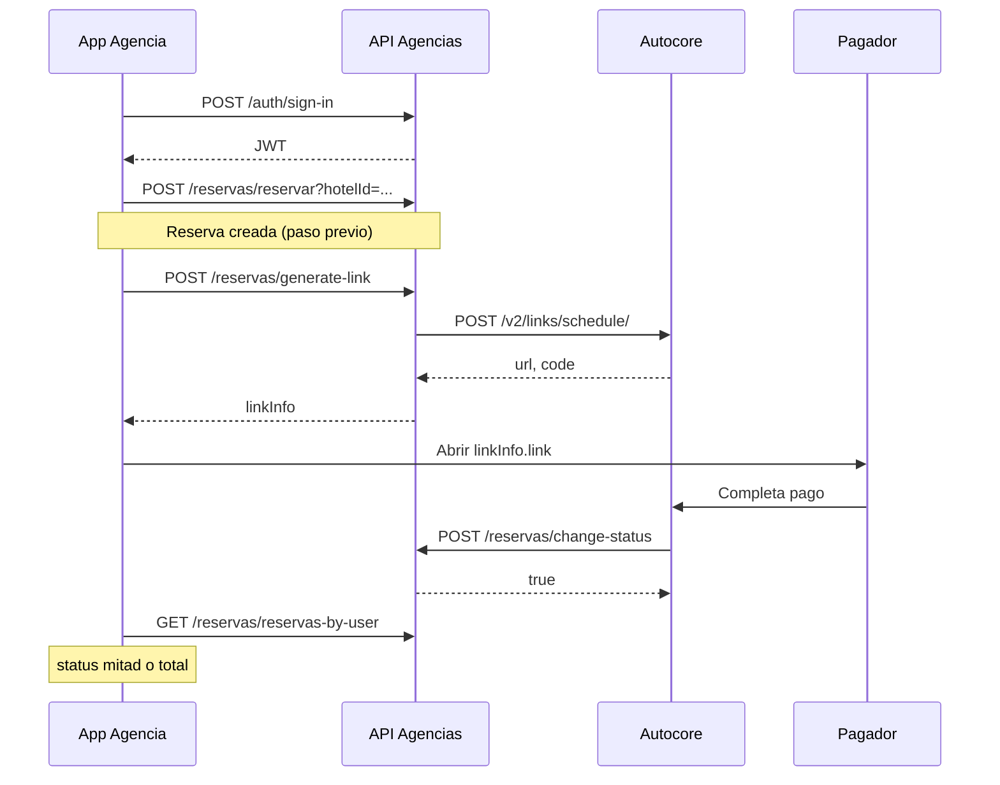
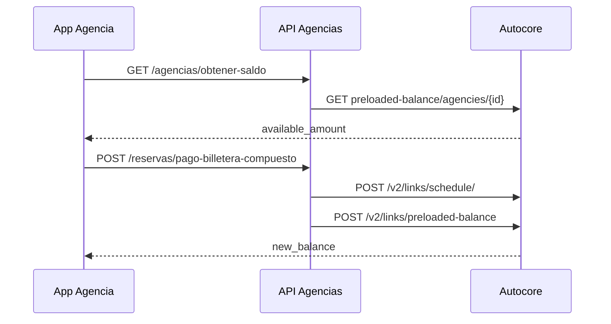

# Manual de integración — Pagos Autocore

**Versión:** 1.0  
**Base URL API Agencias:** `{HOST}/agencias/v1/`  
**Proveedor de pagos:** Autocore (links de cobro + billetera precargada / preloaded balance)

Este manual cubre **todos los endpoints expuestos por esta API** que crean links de pago, cobran con saldo de billetera, recargan billetera o reciben webhooks de Autocore. Incluye el mapeo a las rutas internas de Autocore que usa el backend.

---

## 1. Resumen de capacidades

| Capacidad | Módulo | Uso típico |
|-----------|--------|------------|
| Generar link de pago (tarjeta / pasarela) | `reservas`, `booking-personas` | Cobrar reserva de agencia o persona |
| Pagar con billetera Autocore | `reservas` | Descontar saldo precargado de la agencia |
| Recargar billetera | `agencias` | Agencia añade saldo a su cartera |
| Consultar saldo billetera | `agencias` | Ver `available_amount` en Autocore |
| Webhook cambio de estado | `reservas`, `booking-personas` | Autocore notifica pago aplicado/rechazado |
| Reembolso a billetera | *(interno)* | Cola de cancelación, no es endpoint público |

### APIs Autocore usadas por el backend

| Operación | Método Autocore | Ruta Autocore |
|-----------|-----------------|---------------|
| Crear link de pago | `POST` | `/v2/links/schedule/` |
| Cobrar con billetera | `POST` | `/v2/links/preloaded-balance` |
| Recargar billetera | `POST` | `/v2/preloaded-balance/agencies/{agency_id}` |
| Saldo billetera | `GET` | `/v2/preloaded-balance/agencies/{agency_id}` |
| Reembolso | `POST` | `/v2/preloaded-balance/{idLink}/agencies/{agency_id}/reservation/{chatbotId}/refund` |

Autenticación hacia Autocore: headers `access_key` y `secret_key` (variables `AUTOCORE_ACCESS_KEY`, `AUTOCORE_SECRET_KEY`).

---

## 2. Autenticación en la API Agencias

| Tipo | Endpoints | Header |
|------|-----------|--------|
| **JWT** | Reservas (pagos agencia), Agencias (billetera) | `Authorization: Bearer <accessToken>` |
| **Sin auth** | Webhook reservas | Autocore llama directamente |
| **Token estático** | Booking personas | Header definido en `StaticTokenGuard` (ver Swagger: `x-booking-token`) |

Obtener JWT:

```http
POST /agencias/v1/auth/sign-in
Content-Type: application/json

{ "email": "usuario@agencia.com", "password": "..." }
```

---

## 3. Estados de pago de reserva (`ValidPaymentStatus`)

Usados en la colección `Reserva` cuando el webhook de agencias actualiza el estado:

| Valor | Enum | Significado |
|-------|------|-------------|
| `0` | `espera` | Pendiente de pago |
| `1` | `proceso` | En proceso (tras generar link) |
| `2` | `rejected` | Pago rechazado |
| `3` | `total` | Pago total aprobado |
| `4` | `cancelado` | Cancelada |
| `5` | `mitad` | Primera mitad pagada (reservas con pago en dos cuotas) |
| `6` | `reservaAbonada` | Reserva abonada |

### Valores de `payment_status` en webhook (Autocore → API)

| `payment_status` (texto) | Efecto en reservas agencia |
|--------------------------|---------------------------|
| `en proceso` | `status` → espera (0) |
| `rechazado`, `cancelado`, `tarjeta no válida` | `status` → rejected (2) |
| `aplicado` | Si no había primera mitad → `mitad` (5) + `pagadoPrimeraMitad: true`; si ya había mitad → `total` (3) |

> **Coincidencia tolerante:** el webhook normaliza el texto (minúsculas, sin
> acentos, espacios colapsados) y acepta **sinónimos** de cada estado
> (p. ej. `aprobado`/`approved`/`paid` cuentan como `aplicado`;
> `rejected`/`failed`/`declined` como `rechazado`). Un `payment_status` que no
> encaje en ningún grupo **no se ignora en silencio**: se registra como
> `[webhook-pago][ALERTA]` para revisión. Ver los sets en `reservas.service.ts`.

> **Transiciones monótonas (robustez):** un evento tardío o fuera de orden
> **nunca degrada** un pago consolidado. `total`/`cancelado` son terminales;
> `mitad` no se baja a `espera`/`rejected`; y `en proceso` solo aplica desde
> `espera`/`proceso`. Esto evita que un `rechazado` o `en proceso` rezagado
> deje una reserva 100% pagada como rechazada o pendiente.

---

## 4. Módulo Reservas (agencias de viajes)

Prefijo: `/agencias/v1/reservas`

### 4.1 Generar link de pago

| | |
|--|--|
| **Método** | `POST` |
| **Ruta** | `/reservas/generate-link` |
| **Auth** | JWT (usuario de agencia) |

Crea un link de cobro en Autocore (`POST /v2/links/schedule/`) y guarda `linkInfo` en la reserva. Pone la reserva en `status: 1` (proceso).

**Body (`GenerateLinkDto`):**

```json
{
  "reservaId": "507f1f77bcf86cd799439011",
  "pagoTotal": false
}
```

| Campo | Tipo | Requerido | Descripción |
|-------|------|-----------|-------------|
| `reservaId` | MongoId | Sí | `_id` de la reserva en MongoDB |
| `pagoTotal` | boolean | No | `false` (default) = monto `totalMitad`; `true` = monto `total` completo |

**Respuesta (200):**

```json
{
  "linkInfo": {
    "link": "https://...",
    "expirationDate": "2026-05-19T16:20:00.000Z",
    "idLinkPago": "CODIGO_LINK_AUTOCORE"
  }
}
```

**Reglas de negocio:**

- La reserva no debe estar cancelada (`status` 4) ni pagada total (`status` 3).
- `external_ref_id` enviado a Autocore: `{reservaId}` o `{reservaId} pagoTotal` (el webhook usa esto para saber si es pago total).
- `temp_webhook_url` configurado en servidor: `https://gehsuitesapps.com/agencias/v1/reservas/change-status`
- `agency_id` y datos de contacto salen de la agencia del usuario autenticado (`autocoreInfo.id`).

**cURL:**

```bash
curl -X POST "{HOST}/agencias/v1/reservas/generate-link" \
  -H "Authorization: Bearer <TOKEN>" \
  -H "Content-Type: application/json" \
  -d '{"reservaId":"507f1f77bcf86cd799439011","pagoTotal":false}'
```

---

### 4.2 Pagar con billetera (un paso — código de link)

| | |
|--|--|
| **Método** | `POST` |
| **Ruta** | `/reservas/pago-billetera-single` |
| **Auth** | JWT |

Ejecuta `POST /v2/links/preloaded-balance` con el **código** del link generado previamente. Descuenta saldo de la billetera Autocore de la agencia.

**Body (`PagoReservaBilleteraDto`):**

```json
{
  "code": "CODIGO_DEVUELTO_EN_idLinkPago"
}
```

**Respuesta (200):**

```json
{
  "msg": "mensaje de Autocore",
  "new_balance": 1500000
}
```

**Flujo típico:** primero `generate-link` → obtener `linkInfo.idLinkPago` → luego este endpoint con ese `code`.

---

### 4.3 Pagar reserva con billetera (compuesto)

| | |
|--|--|
| **Método** | `POST` |
| **Ruta** | `/reservas/pago-billetera-compuesto` |
| **Auth** | JWT |

Combina en una sola llamada:

1. `generarLinkPago` (mismo body que `generate-link`)
2. `realizarPagoBilletera` con el `code` del link recién creado

**Body:** mismo `GenerateLinkDto` que en §4.1.

**Respuesta:** resultado de `pagoBalanceAutocore` (`msg`, `new_balance`).

```bash
curl -X POST "{HOST}/agencias/v1/reservas/pago-billetera-compuesto" \
  -H "Authorization: Bearer <TOKEN>" \
  -H "Content-Type: application/json" \
  -d '{"reservaId":"507f1f77bcf86cd799439011","pagoTotal":true}'
```

---

### 4.4 Webhook — cambio de estado de pago (Autocore → API)

| | |
|--|--|
| **Método** | `POST` |
| **Ruta** | `/reservas/change-status` |
| **Auth** | **Ninguna** (lo invoca Autocore) |

Debe estar registrada en Autocore como `temp_webhook_url` al crear el link.

**Body:**

```json
{
  "external_ref_id": "507f1f77bcf86cd799439011 pagoTotal",
  "transaction_id": "txn-autocore-123",
  "payment_status": "aplicado",
  "details": {
    "id": "id-detalle-pago",
    "pay_platform": "tarjeta"
  }
}
```

| Campo | Descripción |
|-------|-------------|
| `external_ref_id` | Primera parte = `reservaId` MongoDB; segunda parte opcional `pagoTotal` |
| `transaction_id` | ID transacción Autocore (idempotencia) |
| `payment_status` | Ver tabla §3 |
| `details.id` | Identificador del evento de pago |
| `details.pay_platform` | Plataforma (opcional) |

**Respuesta:** `true` (ack 200) en todos los casos de negocio — incluso si la
reserva no existe, el estado es desconocido o el evento es duplicado/tardío
(se registra en logs). Solo devuelve error 5xx ante fallos transitorios
(p. ej. base de datos), para que Autocore pueda **reintentar**.

**Idempotencia:** la clave es `transaction_id` (o, si falta, `details.id`) +
`payment_status` normalizado, persistida en `paymenIds`. Un evento ya procesado
responde `true` sin duplicar efecto. El procesamiento usa actualizaciones
atómicas (`findOneAndUpdate`), por lo que reintentos y entregas concurrentes no
producen estados inconsistentes.

---

## 5. Módulo Agencias — Billetera precargada

Prefijo: `/agencias/v1/agencias`

Requiere que la agencia tenga `autocoreInfo.id` (ID de agencia en Autocore) creado al registrar la agencia.

### 5.1 Recargar billetera (generar link de recarga)

| | |
|--|--|
| **Método** | `POST` |
| **Ruta** | `/agencias/recharge-wallet` |
| **Auth** | JWT (agencia del usuario) |

Llama a Autocore `POST /v2/preloaded-balance/agencies/{agency_id}`.

**Body (`RechargeWalletDto`):**

```json
{
  "amount": 500000,
  "currency": "COP"
}
```

| Campo | Validación |
|-------|------------|
| `amount` | Entre **50.000** y **50.000.000** COP (`agenciaRecargaLimit`) |
| `currency` | Solo `COP` (default `COP` si se omite) |

**Respuesta (200):**

```json
{
  "msg": "mensaje",
  "url": "https://url-pago-recarga",
  "code": "codigo-link-recarga"
}
```

El usuario completa el pago en `url`; el saldo se acredita en Autocore en la billetera de la agencia.

```bash
curl -X POST "{HOST}/agencias/v1/agencias/recharge-wallet" \
  -H "Authorization: Bearer <TOKEN>" \
  -H "Content-Type: application/json" \
  -d '{"amount":500000,"currency":"COP"}'
```

---

### 5.2 Consultar saldo de billetera

| | |
|--|--|
| **Método** | `GET` |
| **Ruta** | `/agencias/obtener-saldo` |
| **Auth** | JWT |

Llama a Autocore `GET /v2/preloaded-balance/agencies/{agency_id}`.

**Respuesta (200) — ejemplo:**

```json
{
  "id": 1,
  "agency_id": 42,
  "name": "Nombre cartera",
  "description": "...",
  "available_amount": 2500000,
  "min_recharge_amount": 50000,
  "max_recharge_amount": 50000000,
  "is_archived": false,
  "created_at": "...",
  "updated_at": "..."
}
```

Campo clave para el front: **`available_amount`** (saldo disponible para pagar reservas con billetera).

```bash
curl "{HOST}/agencias/v1/agencias/obtener-saldo" \
  -H "Authorization: Bearer <TOKEN>"
```

---

## 6. Módulo Booking Personas (B2C / token estático)

Prefijo: `/agencias/v1/booking-personas`  
Auth: **token estático** (header configurado en el guard, no JWT de agencia).

### 6.1 Generar link de pago (personas)

| | |
|--|--|
| **Método** | `POST` |
| **Ruta** | `/booking-personas/generar-link-pago?hotelId={hotelId}` |
| **Auth** | Token estático |

`hotelId` = ID Autocore del hotel (mismo catálogo que reservas, ej. `13645`).

**Body (`GeneratePaymentLinkPersonasDto`):**

```json
{
  "hotel_id": "13645",
  "amount": 850000,
  "currency": "COP",
  "guest_name": "Juan Pérez",
  "email": "juan@example.com",
  "phone": "+573001234567",
  "booking_dates": "2026-06-10 - 2026-06-13",
  "description": "Pago reserva 3 noches Hotel Azuan",
  "reservation_data": {
    "reservation": { "...": "..." },
    "titularInfo": { "...": "..." }
  }
}
```

| Campo | Requerido | Notas |
|-------|-----------|-------|
| `amount` | Sí | Monto a cobrar |
| `currency` | Sí | Ej. `COP` |
| `guest_name`, `email`, `phone` | Sí | Datos del huésped |
| `booking_dates`, `description` | Sí | Texto para Autocore |
| `hotel_id` en body | Sí en DTO | El hotel efectivo viene del **query** `hotelId` |
| `reservation_data` | No | Si se envía, la reserva puede crearse **automáticamente** al webhook `aplicado` |

**Respuesta:**

```json
{
  "payment_url": "https://...",
  "payment_code": "CODIGO_LINK",
  "message": "Link de pago generado exitosamente..."
}
```

Persiste registro en `payment_pending` con `payment_code`, `external_ref_id`, `reservation_data`.

Webhook configurado: `https://gehsuitesapps.com/agencias/v1/booking-personas/change-status`

---

### 6.2 Crear reserva tras pago (manual)

| | |
|--|--|
| **Método** | `POST` |
| **Ruta** | `/booking-personas/reservar?hotelId={id}&paymentCode={code}` |
| **Auth** | Token estático |

Si no se usó `reservation_data` en el link, el cliente paga y luego llama aquí con el `payment_code`.

**Query:**

| Parámetro | Requerido |
|-----------|-----------|
| `hotelId` | Sí |
| `paymentCode` | Sí — mismo `payment_code` del link |

---

### 6.3 Webhook — cambio de estado (personas)

| | |
|--|--|
| **Método** | `POST` |
| **Ruta** | `/booking-personas/change-status` |
| **Auth** | Ninguna |

Mismo shape de payload que §4.4. Busca por `external_ref_id` en `payment_pending`.

| `payment_status` | Efecto |
|------------------|--------|
| `aplicado` | Marca pago PAID; si hay `reservation_data`, crea reserva automática |
| `rechazado`, `cancelado`, `tarjeta no válida` | REJECTED |
| `en proceso` | Sin cambio (pendiente) |

---

## 7. Flujos recomendados

### 7.1 Agencia — pago con tarjeta (link externo)



### 7.2 Agencia — pago con billetera



### 7.3 Personas — pago + reserva automática

1. `POST /booking-personas/generar-link-pago?hotelId=13645` con `reservation_data`
2. Usuario paga en `payment_url`
3. Autocore → `POST /booking-personas/change-status` con `aplicado`
4. API crea reserva en Autocore automáticamente

---

## 8. Mapeo `hotel_id` para pagos

Autocore usa IDs numéricos distintos al `hotelId` de creación de reserva. El backend mapea por **nombre de hotel** (`hotelesAutocorePaymenLink`):

| Hotel | `hotel_id` pago |
|-------|-----------------|
| Hotel Azuan | 1 |
| Hotel Aixo | 4 |
| Hotel Avexi | 6 |
| Hotel Marina | 9 |
| Hotel Bocagrande | 7 |
| Hotel Abi | 5 |
| Hotel Boquilla | 56 |
| Hotel Windsor | 10 |
| Hotel Madisson | 3 |
| Hotel Rodadero | 8 |
| Hotel Axis | 48 |
| Hotel Sansiraka | 44 |
| Playa Salguero Hotel | 123 |

Lista completa: `src/config/constants/autocoreConstants.ts`.

---

## 9. Payload enviado a Autocore (link agencias) — referencia

El servicio arma internamente (`createLinkPagoAutocore`):

| Campo Autocore | Origen |
|----------------|--------|
| `hotel_id` | Tabla §8 según `reserva.hotel` |
| `agency_id` | `agencia.autocoreInfo.id` |
| `amount` | `total` o `totalMitad` según `pagoTotal` |
| `guest_name` | `agencia.fullName` |
| `email` | `agencia.emailContacto` |
| `phone` | `agencia.telefonoContacto` |
| `currency` | `reservation.currency` |
| `booking_dates` | `checkin - checkout` |
| `description` | Texto con `reservaChatbotId` |
| `reservation_id` | `reservaChatbotId` |
| `external_ref_id` | `{reservaId}` o `{reservaId} pagoTotal` |
| `source` | `Booking Connect` |
| `available_hours` | `0.1666` (~10 min) |
| `temp_webhook_url` | URL webhook reservas |
| `redirect.success_url` / `failure_url` | URLs fijas agencia.gehsuites.com |

---

## 10. Errores frecuentes

| HTTP | Causa probable |
|------|----------------|
| `401` | JWT ausente/expirado o token estático incorrecto (personas) |
| `404` | `reservaId` o agencia no encontrada |
| `400` | Monto de recarga fuera de rango; `paymentCode` faltante en reservar personas |
| `500` | Autocore no responde; credenciales `AUTOCORE_*` inválidas |

Errores típicos de Autocore en billetera: saldo insuficiente (`new_balance` no actualizado como esperado).

---

## 11. Reembolso (solo uso interno)

No hay endpoint público documentado para integradores. El backend usa `reembolsoCartera` en la **cola de cancelación** (`CancellationTasksQueueService`) al cancelar reservas elegibles.

Ruta Autocore:

`POST /v2/preloaded-balance/{idLink}/agencies/{agenciaId}/reservation/{chatbotId}/refund`

---

## 12. Checklist de integración

### Agencias (JWT)

- [ ] Login → JWT  
- [ ] Crear reserva → `reservaChatbotId`  
- [ ] `POST /reservas/generate-link` o `pago-billetera-compuesto`  
- [ ] Redirigir usuario a `linkInfo.link` **o** usar billetera  
- [ ] Escuchar actualización vía webhook / consultar reserva (`status`)  
- [ ] Opcional: `GET /agencias/obtener-saldo` y `POST /agencias/recharge-wallet`

### Personas (token estático)

- [ ] `POST /booking-personas/generar-link-pago?hotelId=...`  
- [ ] Pago en `payment_url`  
- [ ] Webhook `aplicado` **o** `POST /reservar?paymentCode=...`

---

## 13. Referencias en código

| Tema | Archivo |
|------|---------|
| Controlador reservas | `src/reservas/reservas.controller.ts` |
| Servicio pagos reservas | `src/reservas/reservas.service.ts` → `generarLinkPago`, `realizarPagoBilletera`, `cambiarEstadoPagoAutocore` |
| DTOs | `src/reservas/dto/generate-link.dto.ts`, `pago-reserva-billetera.dto.ts` |
| Controlador agencias | `src/agencias/agencias.controller.ts` |
| Cliente HTTP Autocore | `src/common/services/http-custom.service.ts` |
| Interfaces | `src/common/interface/autocoreCartera/` |
| Booking personas | `src/booking-personas/booking-personas.controller.ts` |
| Estados pago | `src/reservas/interfaces/validPaymentStatus.interface.ts` |
| Límites recarga | `src/config/constants/autocoreConstants.ts` → `agenciaRecargaLimit` |

---

*Documento alineado al código del repositorio agenicias-api.*
