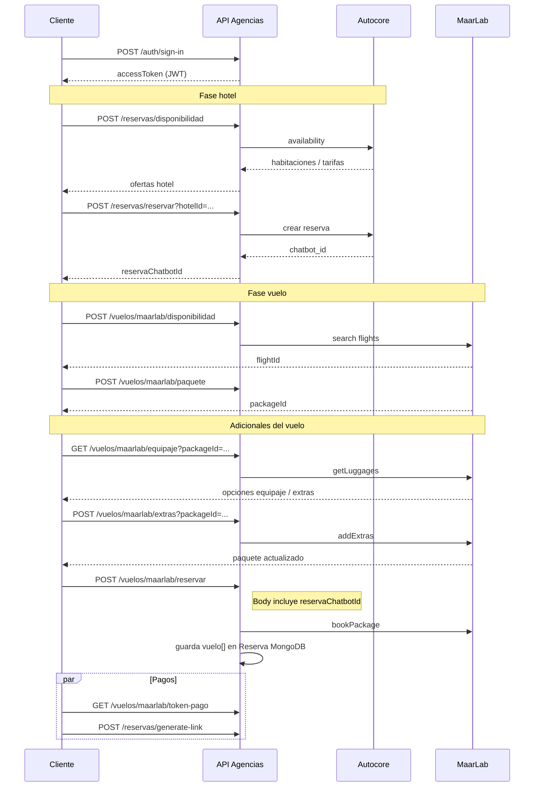
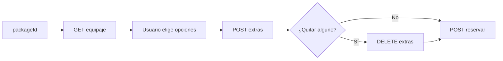

# Manual de integración — Paquete Vuelo + Hotel

**Versión:** 1.1  
**Base URL API:** `{HOST}/agencias/v1/`  
**Alcance:** flujo de creación de un paquete combinado (reserva de hotel en Autocore + vuelo en MaarLab Oceanflights).

> **Fuera de alcance:** búsqueda de aeropuertos con Amadeus (`GET /vuelos/ubicaciones`). Para códigos IATA use el catálogo local documentado en [MANUAL_CONSULTA_AEROPUERTOS_POR_NOMBRE.md](./MANUAL_CONSULTA_AEROPUERTOS_POR_NOMBRE.md).

---

## 1. Resumen del flujo

El paquete **vuelo + hotel** se arma en dos capas:

| Capa | Proveedor | Qué se reserva |
|------|-----------|----------------|
| Hotel | **Autocore** (vía API Agencias) | Habitaciones, fechas, titular, pagos diferidos |
| Vuelo | **MaarLab Oceanflights** (vía API Agencias) | Búsqueda, paquete, pasajeros, pago del vuelo |

La **unión** entre ambas partes es el identificador `reservaChatbotId` (localizador Autocore del hotel). Ese valor se envía al reservar el vuelo en MaarLab para persistir la respuesta en el documento `Reserva` de MongoDB.



---

## 2. Requisitos previos

### 2.1 Autenticación

Todos los endpoints de reservas y MaarLab requieren **JWT Bearer**:

```http
Authorization: Bearer <accessToken>
```

Obtener token:

| Método | Ruta | Body |
|--------|------|------|
| `POST` | `/auth/sign-in` | `{ "email": "...", "password": "..." }` |

Respuesta típica: `accessToken`, `refreshToken` (usar `accessToken` en el header).

### 2.2 Credenciales MaarLab por agencia

Los endpoints bajo `/vuelos/maarlab/*` resuelven el bearer de MaarLab según la **agencia del usuario** autenticado:

1. Credencial en colección `MaarlabPartnerCredential` vinculada por `agenciaId`
2. Credencial por `hotelName` = `agencia.fullName`
3. Campo legado `agencia.maarlabApiKey`

Si ninguna existe, la API responde `400` indicando que falta API key de MaarLab.

### 2.3 Códigos IATA (origen / destino del vuelo)

Para armar `origin` y `destination` en la disponibilidad MaarLab, use el **catálogo local** (MongoDB), no Amadeus:

| Método | Ruta | Auth |
|--------|------|------|
| `GET` | `/referencia-aeropuertos/sugerencias?q={texto}&country=CO&limit=20` | JWT |

Ejemplo: `q=bogota` → `iata: "BOG"`, `q=cartagena` → `iata: "CTG"`.

Detalle completo: [MANUAL_CONSULTA_AEROPUERTOS_POR_NOMBRE.md](./MANUAL_CONSULTA_AEROPUERTOS_POR_NOMBRE.md).

### 2.4 Hoteles disponibles (Autocore)

El query `hotelId` en crear reserva debe ser un ID de Autocore configurado en el backend. Ejemplos:

| hotelId | Ciudad | Nombre |
|---------|--------|--------|
| `13645` | Cartagena | Hotel Azuan |
| `13633` | Cartagena | Hotel Aixo |
| `18004` | Bogotá | Hotel Windsor |
| `17491` | Santa Marta | Hotel Rodadero |
| … | … | Ver `src/config/constants/autocoreConstants.ts` → `hotelesAutocore` |

Ciudades válidas en disponibilidad: `CARTAGENA`, `SANTA_MARTA`, `BOGOTA`.

---

## 3. Fase 1 — Hotel (Autocore)

### Paso 1.1 — Disponibilidad de hotel

| | |
|--|--|
| **Método** | `POST` |
| **Ruta** | `/reservas/disponibilidad` |
| **Auth** | JWT obligatorio |

**Body (`DisponibilidadAutocoreDto`):**

```json
{
  "checkingDate": "2026-06-10",
  "nights": 3,
  "ciudad": "CARTAGENA",
  "layout": [
    { "adults": 2, "children_ages": [8] }
  ],
  "category": 0
}
```

| Campo | Tipo | Requerido | Descripción |
|-------|------|-----------|-------------|
| `checkingDate` | string | Sí | Check-in `YYYY-MM-DD` |
| `nights` | number | Sí | Noches (≥ 1) |
| `ciudad` | enum | Sí | `CARTAGENA`, `SANTA_MARTA`, `BOGOTA` |
| `layout` | array | Sí | Por habitación: `adults`, opcional `children_ages[]` |
| `category` | 0 \| 1 | No | `0` minorista, `1` mayorista. Si se omite, se usa la categoría de la agencia |

**Respuesta:** array de hoteles con `availability[].available_rooms[]` y `products[]` (incluye `roomId`, `rateId`, precios por día). Guardar de cada habitación elegida:

- `roomId` → se envía como `id` en `roomsData`
- `rateId` → `rateId` en `roomsData`
- `unitaryPrice`, fechas, moneda

---

### Paso 1.2 — Crear reserva de hotel

| | |
|--|--|
| **Método** | `POST` |
| **Ruta** | `/reservas/reservar?hotelId={hotelId}` |
| **Auth** | JWT obligatorio |

**Query:**

| Parámetro | Descripción |
|-----------|-------------|
| `hotelId` | ID Autocore del hotel (ej. `13645`) |

**Body (`CreateReservaDto`) — estructura mínima recomendada:**

```json
{
  "total": 1350000,
  "titularInfo": {
    "firstName": "María",
    "lastName": "Pérez",
    "tipoDocumento": "CC",
    "documento": "1023456789",
    "fechaNacimiento": "1990-05-12"
  },
  "reservaInfo": {
    "agency": {
      "is_agency": true,
      "agency_type": 1,
      "external_ref_id": "AG-001"
    },
    "reservation": {
      "adults": "2",
      "checkin": "2026-06-10",
      "checkout": "2026-06-13",
      "children": "0",
      "children_ages": "",
      "city": "CARTAGENA",
      "country": "COL",
      "currency": "COP",
      "email": "maria.perez@example.com",
      "telephone": "+573001234567",
      "firstName": "María",
      "lastName": "Pérez",
      "nights": "3",
      "notes": "",
      "rooms": "1",
      "roomsData": [
        {
          "nombreHabitacion": "Habitación Doble",
          "adults": "2",
          "children": "0",
          "children_ages": "",
          "checkin": "2026-06-10",
          "checkout": "2026-06-13",
          "currency": "COP",
          "id": "ROOM_ID_DE_DISPONIBILIDAD",
          "quantity": "1",
          "rateId": "RATE_ID_DE_DISPONIBILIDAD",
          "unitaryPrice": 450000
        }
      ]
    }
  },
  "origenIata": "BOG"
}
```

**Campos obligatorios (resumen):**

| Nivel | Campos |
|-------|--------|
| Raíz | `total`, `titularInfo`, `reservaInfo` |
| `titularInfo` | `firstName`, `lastName`, `tipoDocumento`, `documento`, `fechaNacimiento` |
| `reservaInfo.agency` | `is_agency`, `agency_type` (0\|1), `external_ref_id` |
| `reservation` | `adults`, `checkin`, `checkout`, `city`, `country`, `currency`, `email`, `telephone`, `firstName`, `lastName`, `nights`, `rooms`, `roomsData[]` |
| `roomsData[]` | `nombreHabitacion`, `adults`, `checkin`, `checkout`, `currency`, `id`, `quantity`, `rateId`, `unitaryPrice` |

**Opcionales útiles:** `notes`, `planAlimentario`, `mascotas`, `mascotasNumber`, `infoTransporte`, `infoToures`, retenciones, `exentoIva`, `asistentes[]`.

**Respuesta exitosa (campos clave):**

```json
{
  "reservaChatbotId": "CB88D9393D",
  "total": 1350000,
  "titularInfo": { "...": "..." },
  "reservaInfo": { "...": "..." }
}
```

> **Importante:** conservar `reservaChatbotId` — es el vínculo con el vuelo y con pagos/cancelaciones del hotel.

**Errores frecuentes:**

| HTTP | Causa |
|------|--------|
| `409` | Habitación no disponible (`no_available_rooms` desde Autocore) |
| `400` | `hotelId` inválido o ciudad no permitida |

---

## 4. Fase 2 — Vuelo (MaarLab)

Prefijo de rutas: `/vuelos/maarlab/`

### Paso 2.1 — Buscar vuelos

| | |
|--|--|
| **Método** | `POST` |
| **Ruta** | `/vuelos/maarlab/disponibilidad` |
| **Auth** | JWT obligatorio |

**Body (`MaarLabFlightSearchDto`):**

```json
{
  "origin": "BOG",
  "destination": "CTG",
  "departureDate": "2026-06-10",
  "returnDate": "2026-06-13",
  "adults": 2,
  "ages": [8],
  "currency": "USD",
  "search_mode": "SEARCH_BEST_DEAL",
  "canarian_resident": false,
  "balear_resident": false,
  "ceuta_melilla_resident": false
}
```

| Campo | Requerido | Notas |
|-------|-----------|-------|
| `origin`, `destination` | Sí | Códigos IATA (mayúsculas) |
| `departureDate` | Sí | `YYYY-MM-DD` |
| `returnDate` | No | Ida y vuelta |
| `adults` | Sí | 1–9 |
| `ages` | No | Edades de niños (0–17), máx. 8 |
| `currency` | Sí | 3 letras, ej. `USD`, `EUR` |

**Respuesta:** lista de ofertas MaarLab. Extraer **`flightId`** de la opción elegida (estructura depende de MaarLab; suele venir en cada ítem de vuelo).

---

### Paso 2.2 — Crear paquete de vuelo

| | |
|--|--|
| **Método** | `POST` |
| **Ruta** | `/vuelos/maarlab/paquete?info=all` |
| **Auth** | JWT obligatorio |

**Body (`CreatePackageDto`):**

```json
{
  "flightId": "FLIGHT_ID_DE_DISPONIBILIDAD",
  "currency": "USD",
  "language": "ES",
  "hotel": {
    "webhook": {
      "booking_url": "https://tu-dominio.com/webhooks/maarlab/booking",
      "payment_url": "https://tu-dominio.com/webhooks/maarlab/payment",
      "canceled_url": "https://tu-dominio.com/webhooks/maarlab/canceled",
      "contracting_url": "https://tu-dominio.com/webhooks/maarlab/contracting"
    }
  }
}
```

| Campo | Requerido | Notas |
|-------|-----------|-------|
| `flightId` | Sí | Del paso 2.1 |
| `currency` | No | `USD` o `EUR` |
| `language` | No | `EN` o `ES` |
| `hotel.webhook` | No | URLs para callbacks MaarLab (paquete vuelo+hotel) |

**Respuesta:** objeto con **`packageId`** (ej. `MAH-C7GQ0G`). Conservarlo para equipaje, extras, reserva y pago.

---

### Paso 2.3 — Adicionales del vuelo (equipaje y extras)

Estos pasos forman parte del flujo estándar cuando el usuario debe elegir **maletas u otros servicios** antes de confirmar pasajeros. Orden: **crear paquete → consultar equipaje → agregar extras → reservar**.



#### 2.3.1 — Consultar equipaje / adicionales disponibles

| | |
|--|--|
| **Método** | `GET` |
| **Ruta** | `/vuelos/maarlab/equipaje` |
| **Auth** | JWT obligatorio |

**Query:**

| Parámetro | Requerido | Descripción |
|-----------|-----------|-------------|
| `packageId` | Sí | ID del paquete (paso 2.2) |

**Ejemplo:**

```http
GET /agencias/v1/vuelos/maarlab/equipaje?packageId=MAH-C7GQ0G
Authorization: Bearer <accessToken>
```

**Respuesta:** estructura definida por MaarLab (lista de opciones de equipaje/servicios por pasajero o segmento). De cada ítem que el usuario seleccione, conserve para el paso siguiente:

| Campo a guardar | Uso en `POST extras` |
|-----------------|----------------------|
| `extraId` | Identificador del extra (hash largo) |
| `typeExtraId` | Tipo de extra (ej. `"1"` equipaje facturado) |
| `passengerId` | Pasajero dentro del paquete (ej. `"0"`, `"1"`) |

> Si la respuesta no trae `extraId` en el formato esperado, revise el JSON completo o consulte el paquete con `GET /vuelos/maarlab/paquete?packageId=...&info=all`.

**Errores frecuentes:**

| HTTP | Causa |
|------|--------|
| `400` | `packageId` ausente o vacío |
| `404` | `packageId` inexistente en MaarLab |
| `401` | API key MaarLab de la agencia inválida |

---

#### 2.3.2 — Agregar extras al paquete

| | |
|--|--|
| **Método** | `POST` |
| **Ruta** | `/vuelos/maarlab/extras` |
| **Auth** | JWT obligatorio |

**Query:**

| Parámetro | Requerido | Descripción |
|-----------|-----------|-------------|
| `packageId` | Sí* | ID del paquete |
| `info` | No | Default `all` — nivel de detalle de la respuesta |

\* También puede enviarse `packageId` en el body (ver abajo). Si va en query y en body, **prioriza el query**.

**Body (`AddExtrasDto`):**

```json
{
  "extras": [
    {
      "extraId": "9977753d0dd96c2a41bb5e2949308208fba42893a6e79807e047ef8a027f92ea",
      "typeExtraId": "1",
      "passengerId": "0"
    },
    {
      "extraId": "otro_hash_de_get_equipaje",
      "typeExtraId": "1",
      "passengerId": "1"
    }
  ]
}
```

| Campo | Requerido | Descripción |
|-------|-----------|-------------|
| `extras` | Sí | Array con al menos un elemento |
| `extras[].extraId` | Sí | Del paso 2.3.1 |
| `extras[].typeExtraId` | Sí | Del paso 2.3.1 (string) |
| `extras[].passengerId` | Sí | Del paso 2.3.1 (string) |
| `packageId` | No | Alternativa al query param |

**Ejemplo con `packageId` en query:**

```http
POST /agencias/v1/vuelos/maarlab/extras?packageId=MAH-C7GQ0G&info=all
Authorization: Bearer <accessToken>
Content-Type: application/json

{
  "extras": [
    {
      "extraId": "9977753d0dd96c2a41bb5e2949308208fba42893a6e79807e047ef8a027f92ea",
      "typeExtraId": "1",
      "passengerId": "0"
    }
  ]
}
```

**Respuesta:** paquete actualizado en MaarLab (precio total puede cambiar). Puede repetir `POST extras` si el usuario añade más servicios en pantallas sucesivas.

**Nota técnica:** la API Agencias expone `POST`; internamente reenvía a MaarLab `PUT /addExtras/` con `packageId` y `extras` en el body.

---

#### 2.3.3 — Eliminar un extra del paquete

| | |
|--|--|
| **Método** | `DELETE` |
| **Ruta** | `/vuelos/maarlab/extras` |
| **Auth** | JWT obligatorio |

**Query (todos requeridos):**

| Parámetro | Descripción |
|-----------|-------------|
| `packageId` | ID del paquete |
| `itemId` | ID del ítem extra ya agregado (entero; suele venir en la respuesta tras agregar o en detalle del paquete) |
| `typeExtraId` | Mismo tipo usado al agregar (entero en query) |
| `info` | Opcional, default `all` |

**Ejemplo:**

```http
DELETE /agencias/v1/vuelos/maarlab/extras?packageId=MAH-C7GQ0G&itemId=123&typeExtraId=1&info=all
Authorization: Bearer <accessToken>
```

---

#### 2.3.4 — Verificar paquete antes de reservar (recomendado)

| | |
|--|--|
| **Método** | `GET` |
| **Ruta** | `/vuelos/maarlab/paquete?packageId={packageId}&info=all` |

Confirme que los extras quedaron aplicados y el total es el esperado antes de `POST /vuelos/maarlab/reservar`.

---

### Paso 2.4 — Reservar paquete (vincular con hotel)

| | |
|--|--|
| **Método** | `POST` |
| **Ruta** | `/vuelos/maarlab/reservar?info=all` |
| **Auth** | JWT obligatorio |

Este paso **confirma pasajeros en MaarLab** y **guarda el vuelo en la reserva de hotel** en MongoDB.

**Body (`BookPackageDto`):**

```json
{
  "packageId": "MAH-C7GQ0G",
  "reservaChatbotId": "CB88D9393D",
  "hotel_id": "13645",
  "partner_id": "opcional",
  "passengers": [
    {
      "passengerId": "0",
      "type_passenger": "adult",
      "title": "Mrs",
      "name": "María",
      "surname": "Pérez",
      "email": "maria.perez@example.com",
      "contact_number": "+57 3001234567",
      "date_of_birth": "1990-05-12",
      "document_type": "PASSPORT",
      "document_number": "AB123456",
      "document_issuance": "CO",
      "document_expiration": "2030-05-12",
      "document_issuance_date": "2020-05-12",
      "document_residence": "CO",
      "country_id": "CO",
      "address": "Calle 1 #2-3",
      "province": "Bolívar",
      "city": "Cartagena",
      "postalcode": "130001"
    }
  ],
  "payment": {
    "payment_type": "FLIGHT_NOW_HOTEL_LATER",
    "deferred_payment_date": "2026-06-01"
  }
}
```

| Campo | Requerido | Descripción |
|-------|-----------|-------------|
| `packageId` | Sí | Del paso 2.2 (mismo usado en equipaje/extras) |
| `reservaChatbotId` | **Sí** | Localizador del hotel (paso 1.2). Sin esto la API responde `400` |
| `hotel_id` | No | ID Autocore del hotel (referencia MaarLab) |
| `passengers` | Sí | Un objeto por pasajero |
| `payment` | No | Modalidad de pago del paquete |

**Pasajero (`PassengerDto`) — valores permitidos:**

| Campo | Valores / formato |
|-------|-------------------|
| `type_passenger` | `adult`, `child`, `infant` |
| `title` | `Mr`, `Mrs`, `Miss`, `Ms` |
| `document_type` | `PASSPORT`, `IDENTITY_CARD` |
| `contact_number` | `+<código país> dígitos` (espacios permitidos, ej. `+57 3001234567`) |
| `date_of_birth`, `document_expiration`, `document_issuance_date` | `YYYY-MM-DD` |
| `country_id` | ISO 3166-1 alpha-2 (ej. `CO`) |

**Persistencia interna:** en la colección `Reserva`, campo `vuelo[]`:

```ts
{
  packageId: string;
  respuestaMaarLab: object;  // respuesta MaarLab sin el nodo "hotel"
  createdAt: Date;
}
```

---

## 5. Fase 3 — Pagos

### 5.1 — Pago del vuelo (MaarLab)

| | |
|--|--|
| **Método** | `GET` |
| **Ruta** | `/vuelos/maarlab/token-pago` |
| **Auth** | JWT obligatorio |

**Query:**

| Parámetro | Requerido | Valores |
|-----------|-----------|---------|
| `packageId` | Sí | ID del paquete |
| `paymentType` | No | Ver tabla abajo |
| `deferredPaymentDate` | No | `YYYY-MM-DD`; solo con `FLIGHT_NOW_HOTEL_LATER` |

**Tipos de pago (`paymentType`):**

| Valor | Uso típico en paquete vuelo+hotel |
|-------|-----------------------------------|
| `FLIGHT_ONLY` | Cobrar solo el vuelo ahora |
| `ALL_NOW` | Cobrar vuelo y hotel juntos ahora |
| `FLIGHT_NOW_HOTEL_LATER` | Cobrar vuelo ahora; hotel en fecha diferida (`deferredPaymentDate` obligatoria) |

Ejemplo pago diferido:

```http
GET /vuelos/maarlab/token-pago?packageId=MAH-C7GQ0G&paymentType=FLIGHT_NOW_HOTEL_LATER&deferredPaymentDate=2026-06-01
```

La respuesta incluye el token/URL de pago según MaarLab (usar en el front de checkout).

---

### 5.2 — Pago del hotel (Autocore / Cobre)

| | |
|--|--|
| **Método** | `POST` |
| **Ruta** | `/reservas/generate-link` |
| **Auth** | JWT obligatorio |

**Body (`GenerateLinkDto`):**

```json
{
  "reservaId": "507f1f77bcf86cd799439011",
  "pagoTotal": false
}
```

| Campo | Descripción |
|-------|-------------|
| `reservaId` | `_id` MongoDB de la reserva (obtener de `GET /reservas/reservas-by-user` u otro listado) |
| `pagoTotal` | `true` = pago completo; `false` = primera mitad (reservas con pago en dos cuotas) |

**Respuesta:**

```json
{
  "linkInfo": {
    "link": "https://...",
    "expirationDate": "...",
    "idLinkPago": "..."
  }
}
```

---

## 6. Consultas posteriores

| Acción | Método | Ruta |
|--------|--------|------|
| Sugerencias aeropuertos (IATA) | `GET` | `/referencia-aeropuertos/sugerencias?q=...` |
| Equipaje / adicionales disponibles | `GET` | `/vuelos/maarlab/equipaje?packageId=...` |
| Detalle paquete MaarLab | `GET` | `/vuelos/maarlab/paquete?packageId=...` |
| Contrato ATOL | `GET` | `/vuelos/maarlab/contrato-atol?packageId=...` |
| Mis reservas (incluye `vuelo[]`) | `GET` | `/reservas/reservas-by-user?page=1` |
| Reservas de la agencia | `GET` | `/reservas/reservas-by-agencia?page=1` |

En respuestas de reservas, `reservation.roomsData[]` expone el identificador de habitación como **`room_id`** (valor proveniente del campo interno `id` de Autocore).

---

## 7. Identificadores a conservar en el cliente

| ID | Origen | Uso |
|----|--------|-----|
| `flightId` | Disponibilidad MaarLab | Crear paquete |
| `packageId` | Crear paquete | Equipaje, extras, reservar, token pago, consultas |
| `extraId`, `typeExtraId`, `passengerId` | GET equipaje | POST extras |
| `itemId` | Respuesta extras / detalle paquete | DELETE extras |
| `reservaChatbotId` | Crear reserva hotel | Vincular vuelo, pagos hotel, cancelación |
| `reservaId` (Mongo `_id`) | Respuesta listados / BD | `generate-link`, edición, cancelación local |
| `roomId` / `rateId` | Disponibilidad Autocore | Body `roomsData.id` y `roomsData.rateId` |

---

## 8. Orden recomendado de llamadas (checklist)

1. `POST /auth/sign-in` → JWT  
2. `GET /referencia-aeropuertos/sugerencias` → IATA origen/destino (no usar Amadeus)  
3. `POST /reservas/disponibilidad` → elegir habitación/tarifa  
4. `POST /reservas/reservar?hotelId=...` → guardar **`reservaChatbotId`**  
5. `POST /vuelos/maarlab/disponibilidad` → elegir vuelo, guardar **`flightId`**  
6. `POST /vuelos/maarlab/paquete` → guardar **`packageId`**  
7. `GET /vuelos/maarlab/equipaje?packageId=...` → listar adicionales; guardar `extraId`, `typeExtraId`, `passengerId`  
8. `POST /vuelos/maarlab/extras?packageId=...` → aplicar selección (repetir si el usuario agrega más)  
9. *(Si aplica)* `DELETE /vuelos/maarlab/extras` → quitar un extra  
10. *(Recomendado)* `GET /vuelos/maarlab/paquete?packageId=...` → validar total y extras  
11. `POST /vuelos/maarlab/reservar` con **`reservaChatbotId`** + pasajeros  
12. `GET /vuelos/maarlab/token-pago` según modalidad de cobro  
13. `POST /reservas/generate-link` para cobro del hotel (si aplica)

---

## 9. Validación y errores

- Validación global: `ValidationPipe` con `whitelist` y `forbidNonWhitelisted` — campos no declarados en el DTO generan `400`.
- Módulo vuelos: interceptor/filtro de errores estructurados (`ErrorHandlerInterceptor`, `ErrorHandlerFilter`).
- MaarLab sin API key de agencia: `400 Bad Request`.
- Reserva hotel sin disponibilidad: `409 Conflict`.
- `reservaChatbotId` inexistente al reservar vuelo: `404 Not Found`.

---

## 10. Referencias en código

| Tema | Ubicación |
|------|-----------|
| DTO reserva hotel | `src/reservas/dto/create-reserva.dto.ts` |
| DTO disponibilidad hotel | `src/reservas/dto/disponibilidad-autocore.dto.ts` |
| DTOs MaarLab vuelo | `maarlab-flight-search.dto.ts`, `create-package.dto.ts`, `add-extras.dto.ts`, `book-package.dto.ts` |
| Equipaje / extras MaarLab | `src/vuelos/maarlab.service.ts` → `getLuggage`, `addExtras`, `deleteExtras` |
| Catálogo IATA local | [MANUAL_CONSULTA_AEROPUERTOS_POR_NOMBRE.md](./MANUAL_CONSULTA_AEROPUERTOS_POR_NOMBRE.md) |
| Vinculación vuelo → reserva | `src/vuelos/vuelos.service.ts` → `bookPackageMaarLab` |
| Entidad `vuelo[]` | `src/reservas/entities/reserva.entity.ts` |
| Listado endpoints MaarLab | `LISTADO_ENDPOINTS_MAARLAB.md` |
| Hoteles Autocore | `src/config/constants/autocoreConstants.ts` |

---

*Última revisión según código del repositorio agenicias-api.*
